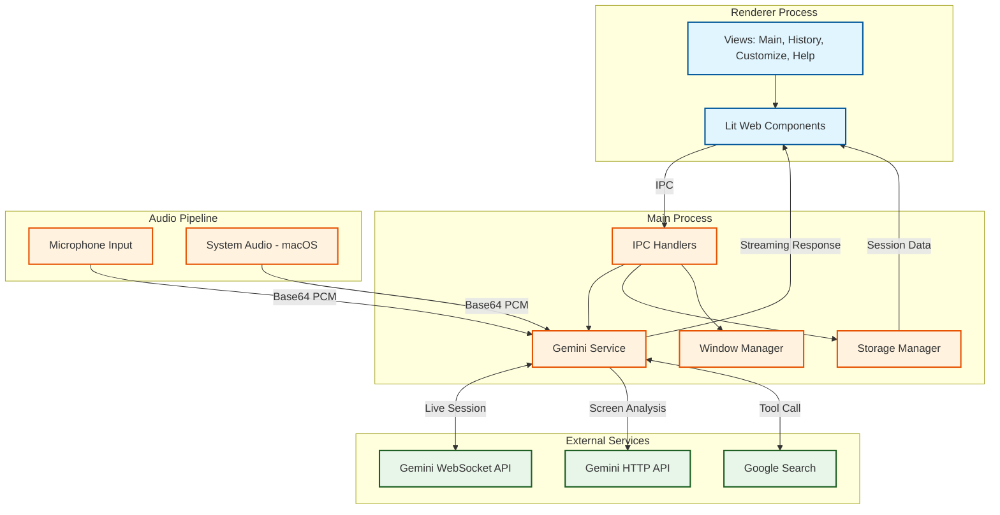

# Design Document: AI Assistant

## 1. Project Objective

The **AI Assistant** is a desktop application designed to provide intelligent, real-time assistance during meetings, interviews, and daily workflows. Built with Electron and powered by Google's Gemini 2.5 models, it integrates seamlessly into the user's environment as a discreet on-screen companion.

## 2. Core Capabilities & Features

### A. Implemented Features (v0.5.0)

#### Real-time Audio Conversation
- **Live Voice Interaction**: Engages in low-latency voice conversations using Gemini's Native Audio (WebSocket) capabilities
- **Speaker Diarization**: Distinguishes between the user (Candidate) and other participants (Interviewer) for tailored responses
- **System Audio Capture**: Analyzes system audio (macOS only) from meeting platforms like Zoom/Teams to understand conversation context
- **Automatic Reconnection**: Handles network instability with up to 3 reconnection attempts and context restoration

#### Visual Intelligence
- **Screen Analysis**: Captures and analyzes screen content to provide context-aware assistance
- **Streaming Responses**: Displays AI responses in real-time as they're generated
- **Rate-Limited Model Switching**: Automatically switches between `gemini-2.5-flash` and `gemini-2.5-flash-lite` based on daily usage limits

#### Multiple Assistant Profiles
| Profile | Use Case |
|---------|----------|
| **Interview** | Job interviews with STAR method responses |
| **Sales** | Sales calls with persuasive, value-focused responses |
| **Meeting** | Professional meetings with clear, action-oriented language |
| **Presentation** | Public speaking with engaging, confident delivery |
| **Negotiation** | Deal-making with strategic, win-win focused responses |
| **Exam** | Academic tests with direct, efficient answers |

#### Tool Integration
- **Google Search**: Real-time web search for current information (toggleable)
- **Custom Context**: User-provided context injected into system prompts

#### Session Management
- **Conversation History**: Full conversation tracking with timestamps
- **Session Persistence**: Save and restore conversation sessions
- **Screen Analysis History**: Track all screen-based interactions

### B. Planned Features (Future Releases)

- **Live Language Translation**: Real-time translation and subtitles for foreign speakers
- **Custom Knowledge Base (RAG)**: Local vector store for user documents
- **Automated Action Item Extraction**: AI-powered task identification from conversations
- **Calendar Integration**: One-click export to Google Calendar and Outlook
- **Proactive Suggestions**: Context-aware information push without explicit queries
- **Voice-Triggered Notes**: Hot-phrase activation for note capture

## 3. System Architecture

## 4. Component Details

### User Interface (Renderer)
- **Framework**: Lit Web Components (vanilla JS, no build step)
- **Views**: Main chat, History, Customize settings, Help/onboarding
- **Rendering**: Marked.js for markdown, Highlight.js for code syntax

### Gemini Service (Main Process)
- **WebSocket Session**: Persistent connection for real-time audio
- **HTTP Client**: Screen analysis and image processing
- **Tool Management**: Dynamic Google Search integration
- **Context Restoration**: Rebuilds conversation context on reconnection

### Storage Manager
- **Location**: OS-specific user data directories
- **Format**: JSON files for config, credentials, preferences, sessions
- **Rate Limiting**: Daily usage tracking per model
- **Version Migration**: Automatic schema upgrades

### Audio Pipeline
- **Microphone**: Captured from renderer, sent via IPC
- **System Audio (macOS)**: `SystemAudioDump` binary captures meeting audio
- **Format**: 16-bit PCM at 24kHz, stereo-to-mono conversion

## 5. Data Flow

### Voice Conversation Flow
1. User speaks → Microphone captures audio
2. Audio converted to base64 PCM → Sent via IPC to main process
3. Main process streams to Gemini WebSocket
4. Gemini processes with speaker diarization
5. Response streamed back → Displayed in UI with markdown formatting
6. Conversation turn saved to session history

### Screen Analysis Flow
1. User triggers screen capture
2. Screenshot encoded as base64 JPEG
3. Sent to Gemini HTTP API with user prompt
4. Streaming response displayed in real-time
5. Analysis saved to screen history

## 6. Technology Stack

| Layer | Technology |
|-------|------------|
| Runtime | Electron 30.x |
| Build | Electron Forge |
| UI | Lit Web Components |
| AI | @google/genai SDK |
| Markdown | Marked.js |
| Code Highlighting | Highlight.js |
| Storage | JSON files (fs) |

---

*Last Updated: 2026-01-26*
