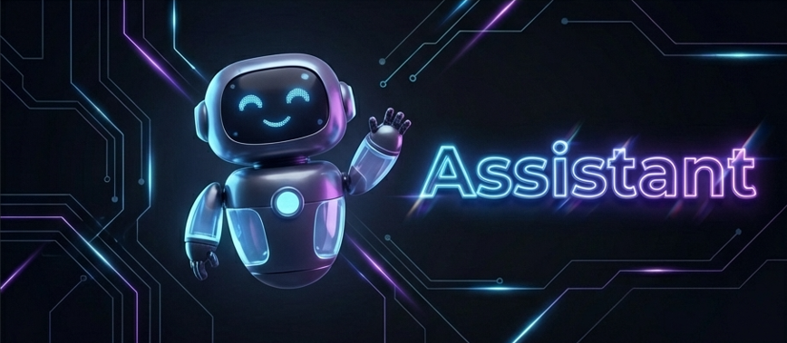

# Assistant

**Real-time AI voice assistant with invisible overlay, dual-layer responses, dynamic RAG, live translation, and screen analysis.**

Built with Electron, Lit, and Google Gemini API.



---

## Overview

Assistant is a desktop AI application that listens to live conversations and provides real-time suggestions through an invisible transparent overlay. It captures both microphone and system audio, streams them to Google Gemini via WebSocket, and displays AI-generated responses that are hidden from screen sharing, screen recording, and screenshot tools.

During sessions, the AI silently creates structured notes (key points, decisions, action items) that are invisible to the user until the session ends -- then exports them as a formatted `.docx` document.

### Key Features

- **Ghost Window** -- Invisible to screen capture APIs (`setContentProtection`), hidden from taskbar and Mission Control, always on top with click-through mode
- **Dual-Layer Response** -- Visible suggestions for the user + silent structured notes accumulated in the background, exported as .docx
- **Dynamic RAG** -- Documents uploaded during session prep are chunked, embedded, and dynamically retrieved based on conversation context (not static prompt injection)
- **Real-Time Translation** -- 28 languages with side-by-side display, Google Cloud Translation API for live tentative translations (~50-100ms) with Gemini fallback
- **Screen Analysis** -- Auto/manual screenshot capture with AI interpretation, timestamped entries with thumbnails and search
- **Co-Pilot Mode** -- Goal-driven sessions with pre-session setup, behavioral markers (`[REFOCUS]`, `[ADVANCE]`), and profile-specific intelligence (Interview, Sales, Negotiation)
- **3-Tab Session UI** -- Assistant (A), Translation (T), Screen (S) tabs with keyboard shortcuts
- **Custom AI Profiles** -- User-created personas with custom system prompts
- **Google Search** -- Real-time web search integration during active sessions for up-to-date information
- **Model Fallback** -- Automatic daily rate limiting with `gemini-2.5-flash` -> `gemini-2.5-flash-lite` fallback
- **Cross-Platform** -- Windows, macOS, Linux

---

## Architecture


### Data Flow

1. **Audio Input** -> PCM conversion -> Gemini WebSocket -> Assistant tab displays response
2. **AI Response** -> Notes parser -> Visible layer / Silent layer separation
3. **Document Upload** -> Chunking -> Embedding generation -> Local JSON storage
4. **Conversation Progress** -> RAG engine -> Relevant chunk retrieval -> Context injection
5. **Translation** -> Speech detection -> Buffering -> Google Cloud Translation API (primary, ~50-100ms) with Gemini fallback (~1-3s) -> Translation tab with live tentative translations
6. **Screen Analysis** -> Screenshot capture -> Gemini Vision API -> Screen tab with timestamped results and thumbnails
7. **Session End** -> Structured notes generation -> .docx export

---

## Getting Started

### Prerequisites

- [Node.js](https://nodejs.org/) v18 or higher
- [Google Gemini API key](https://aistudio.google.com/apikey) (works within free tier)
- Optional: [Google Cloud Translation API key](https://cloud.google.com/translate/docs/setup) for real-time tentative translations

### Installation

```bash
git clone https://github.com/harsh194/assistant.git
cd assistant
npm install
npm start
```

### First-Time Setup

1. The onboarding wizard launches automatically
2. Enter your Gemini API key
3. Select a profile (Interview, Sales, Meeting, etc.)
4. Optional: Upload reference documents for RAG

### Build

```bash
# Package for current platform
npm run package

# Create distributable installer
npm run make
```

Output: `.exe` (Windows), `.dmg` (macOS), `.deb` / `.rpm` / `.AppImage` (Linux)

---

## Usage

### Basic Session

1. Select a profile and enter custom context
2. Click **Start Session**
3. Microphone and system audio capture begins automatically
4. Real-time AI responses appear in the transparent overlay

### Co-Pilot Mode (Recommended)

1. Click **Prepare Session**
2. Enter goal, success criteria, and key topics
3. Upload reference documents (PDF, Word, images, text)
4. Start the session
5. AI creates structured notes silently during conversation
6. After session, review and export notes as .docx

### Keyboard Shortcuts

| Action | macOS | Windows/Linux |
|--------|-------|---------------|
| Show/hide window | `Cmd+\` | `Ctrl+\` |
| Toggle click-through | `Cmd+M` | `Ctrl+M` |
| Next step | `Cmd+Enter` | `Ctrl+Enter` |
| Previous response | `Cmd+[` | `Ctrl+[` |
| Next response | `Cmd+]` | `Ctrl+]` |
| Emergency erase | `Cmd+Shift+E` | `Ctrl+Shift+E` |
| Assistant tab | `A` | `A` |
| Translation tab | `T` | `T` |
| Screen tab | `S` | `S` |
| Cycle tabs | `Tab` | `Tab` |

---

## Tech Stack

| Layer | Technology | Rationale |
|-------|-----------|-----------|
| **Runtime** | Electron 30.x | System audio access, global shortcuts, screen capture exclusion. Impossible with web apps. |
| **AI** | Google Gemini API | Only major model with native audio input (WebSocket/PCM). Embeddings, OCR, translation, screen analysis in one SDK. |
| **Translation** | Google Cloud Translation API | Real-time tentative translations (~50-100ms). Gemini as fallback (~1-3s). |
| **UI** | Lit 2.7 (vanilla JS) | No build step. Edit, reload, test against live audio in seconds. |
| **Storage** | JSON files | Single user, local data, separate files per domain for fault isolation. |
| **Export** | docx | Editable professional documents for sharing session notes. |

### Dependencies

**Production (3 only):**
- `@google/genai` -- Gemini API client
- `docx` -- Word document generation
- `electron-squirrel-startup` -- Windows installer support

**Bundled assets (no CDN):** Lit 2.7.4, Marked.js, Highlight.js

---

## Project Structure

```
src/
├── index.js              # Main process entry, IPC handlers
├── preload.js            # IPC context bridge, channel allowlists
├── storage.js            # JSON persistence layer, rate limiting, model fallback
├── audioUtils.js         # Audio PCM/WAV utilities
├── components/
│   ├── index.js          # Component exports
│   ├── app/
│   │   ├── AssistantApp.js   # Main app component (state, routing, co-pilot)
│   │   └── AppHeader.js      # Header with nav and theme controls
│   ├── ui/
│   │   ├── SkeletonLoader.js # Loading skeleton with shimmer
│   │   ├── LoadingSpinner.js # Animated loading spinner
│   │   └── RequestStatus.js  # Status display with actions
│   └── views/
│       ├── MainView.js           # Start + Prepare + Templates
│       ├── AssistantView.js      # AI response display (3-tab UI)
│       ├── ScreenAnalysisView.js # Screen analysis tab
│       ├── SessionPrepView.js    # Co-Pilot setup form
│       ├── SessionSummaryView.js # Post-session summary + export
│       ├── OnboardingView.js     # Setup wizard
│       ├── HistoryView.js        # Session history browser
│       ├── CustomizeView.js      # Settings (profiles, keybinds, translation)
│       └── HelpView.js           # Help/docs
└── utils/
    ├── gemini.js         # Gemini API (live session + HTTP + RAG + translation)
    ├── prompts.js        # Profile-based prompt templates
    ├── copilotPrompts.js # Co-Pilot behavioral instructions
    ├── chunker.js        # Text chunking for RAG
    ├── embeddings.js     # Vector embeddings (text-embedding-004)
    ├── retrieval.js      # RAG engine (dynamic context injection)
    ├── notesParser.js    # Parse [NOTES], [REFOCUS], [ADVANCE] markers
    ├── notesExporter.js  # Export session notes to .docx
    ├── documentParser.js # Document text extraction (OCR)
    ├── requestState.js   # Request lifecycle states
    ├── renderer.js       # Renderer utilities, screenshot capture
    ├── window.js         # Window management, global shortcuts
    └── windowResize.js   # Resize handlers
```

---

## Gemini API Integration

This project leverages 5 core capabilities of the Google Gemini API:

1. **Gemini Live (Audio Streaming)** -- Direct PCM transmission via WebSocket with ~500ms latency and speaker identification
2. **Embeddings API (text-embedding-004)** -- Document vectorization for RAG with cosine similarity retrieval
3. **Vision API (OCR + Screen Analysis)** -- Text extraction from documents and real-time screenshot interpretation
4. **Translation** -- Google Cloud Translation API (primary, ~50-100ms) with Gemini HTTP API fallback (~1-3s) for 28 languages
5. **Summary Generation** -- Structured session summaries exported as .docx

---

## Detailed Article

For a deep technical walkthrough covering the Ghost Window implementation, Dual-Layer response system, Dynamic RAG architecture, and lessons learned:

- **English**: [article_en.md](./article_en.md)
- **Japanese**: [article_jp.md](./article_jp.md)

---

## Privacy & Security

- **Local-first**: All data stored on user's machine. No cloud transmission except Gemini API calls.
- **Emergency erase**: `Ctrl+Shift+E` / `Cmd+Shift+E` instantly hides window, kills session, clears data, and exits in 300ms.
- **API key safety**: Credentials stored locally in user data directory.

---

## Responsible Use

Assistant is designed for **learning enhancement** and **communication improvement**:

- **Interview Preparation** -- Practice and build confidence through mock interviews
- **Learning Enhancement** -- Deepen understanding and reinforce knowledge
- **Language Support** -- Conversation assistance for non-native speakers
- **Meeting Notes** -- Automatically capture key points while staying focused
- **Cognitive Support** -- Real-time assistance for individuals with anxiety or ADHD

The AI provides suggestions; the human makes decisions and speaks in their own voice.

---

## License

MIT License. See [LICENSE](LICENSE) for details.

Copyright (c) 2026

---

*All conversations, notes, and documents stay on your machine.*
