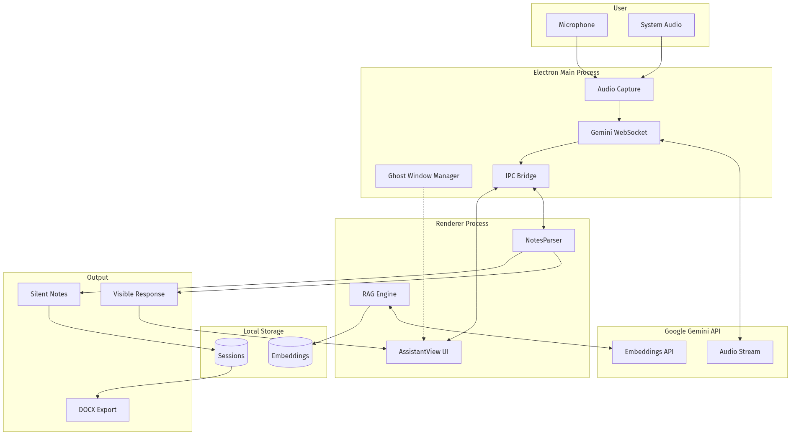

# Assistant: The Invisible AI Co-Pilot for Real-Time Conversations

## 📌 プロジェクト概要 / Project Overview

### 対象ユーザー / Target Users
- **就職面接を受ける求職者** - Job seekers in technical interviews
- **営業担当者** - Sales professionals during client calls
- **ビジネス交渉担当者** - Business negotiators
- **プレゼンター** - Public speakers and presenters
- **学習者・受験準備者** - Students preparing for tests and deepening understanding

### 解決する課題 / Problem Statement

**多くの人が抱える未解決の課題：**

リアルタイムの重要な会話（面接、商談、交渉など）において、適切な情報を瞬時に思い出し、的確に応答することは極めて難しい。既存のAIアシスタントには以下の問題があります：

1. **可視性の問題** - 画面共有やスクリーンレコーディングで相手にAI使用が見えてしまう
2. **操作の遅延** - Alt+Tabでウィンドウを切り替える時間的ロス
3. **コンテキストの欠如** - AIが会話の文脈や背景を理解していない
4. **記録の負担** - 会話中にメモを取ると集中が途切れる

**The Unresolved Challenge:**

During critical real-time conversations (interviews, sales calls, negotiations), recalling relevant information and responding appropriately is extremely difficult. Existing AI assistants have these problems:

1. **Visibility Problem** - AI usage becomes visible through screen sharing/recording
2. **Operation Delay** - Time lost switching windows with Alt+Tab
3. **Lack of Context** - AI doesn't understand conversation context or background
4. **Note-taking Burden** - Taking notes during conversation breaks concentration

### ソリューションの特徴 / Solution Features

**Assistant**は、これらの課題を解決する革新的なデスクトップAIアシスタントです：

**🎯 Core Innovation:**

1. **完全不可視のゴーストウィンドウ**
   - 画面キャプチャ、スクリーンレコーディング、Zoom共有から完全に隠蔽
   - 常に最前面に表示されながら透明で操作可能
   - クリックスルーモードで背景アプリとの干渉なし

2. **デュアルレイヤー応答システム**
   - **可視レイヤー**: ユーザーへの即座の提案・回答
   - **サイレントレイヤー**: AIが自動的に構造化メモを作成（会話中は非表示）
   - 会話終了後、カテゴリ分けされたメモをWord形式で出力

3. **動的RAG（Retrieval-Augmented Generation）**
   - 会話の進行に応じてリアルタイムで関連文書を検索・注入
   - 静的プロンプトではなく、コンテキストに応じた動的情報提供
   - 会話履歴から自動的にクエリを生成し最適なチャンクを取得

4. **ネイティブ音声ストリーミング**
   - Google Gemini の音声API直接統合（WebSocket over PCM）
   - マイク + システム音声の同時キャプチャ
   - 話者識別でコンテキスト把握

---

## 🎬 デモ動画 / Demo Video

@[youtube](YOUR_YOUTUBE_VIDEO_ID)

*（3分程度のデモビデオをYouTubeにアップロードし、上記のIDを置き換えてください）*

---

## 📊 システムアーキテクチャ / System Architecture



### アーキテクチャの主要コンポーネント:

```
┌─────────────────────────────────────────────────────────────┐
│                    Electron Main Process                     │
├─────────────────────────────────────────────────────────────┤
│  ┌──────────────┐  ┌──────────────┐  ┌─────────────────┐  │
│  │ Ghost Window │  │ Audio Capture│  │ Gemini Session  │  │
│  │  Management  │  │  (Mic + Sys) │  │   (WebSocket)   │  │
│  └──────────────┘  └──────────────┘  └─────────────────┘  │
│         │                  │                    │            │
│         │                  │                    │            │
│  ┌──────▼──────────────────▼────────────────────▼────────┐ │
│  │           IPC Bridge (preload.js)                      │ │
│  └─────────────────────────────────────────────────────────┘ │
└─────────────────────────────────────────────────────────────┘
                            │
┌───────────────────────────▼─────────────────────────────────┐
│                    Renderer Process (Lit)                    │
├─────────────────────────────────────────────────────────────┤
│  ┌──────────────┐  ┌──────────────┐  ┌─────────────────┐  │
│  │ AssistantView│  │ NotesParser  │  │ RAG Retrieval   │  │
│  │ (Live UI)    │  │ (Dual-Layer) │  │ Engine          │  │
│  └──────────────┘  └──────────────┘  └─────────────────┘  │
│         │                  │                    │            │
│  ┌──────▼──────────────────▼────────────────────▼────────┐ │
│  │     Response Display & Markdown Rendering             │ │
│  └─────────────────────────────────────────────────────────┘ │
└─────────────────────────────────────────────────────────────┘
                            │
                            ▼
                 ┌─────────────────────┐
                 │  Google Gemini API  │
                 │  - Audio Stream     │
                 │  - Embeddings       │
                 │  - OCR              │
                 └─────────────────────┘
```

### データフロー:
1. **音声入力** → PCM変換 → Gemini WebSocket
2. **AI応答** → ノーツパーサー → 可視レイヤー/サイレントレイヤー分離
3. **文書アップロード** → チャンキング → 埋め込み生成 → ローカルJSON保存
4. **会話進行** → RAGエンジン → 関連チャンク取得 → コンテキスト注入
5. **セッション終了** → 構造化メモ生成 → .docx出力

---

## 🔧 技術実装の詳細 / Technical Implementation

---

## 📋 目次 / Table of Contents

1. [評価基準への対応](#評価基準への対応)
2. [技術実装の詳細](#技術実装の詳細)
   - [ゴーストウィンドウ](#the-ghost-window-hiding-in-plain-sight)
   - [デュアルレイヤーシステム](#dual-layer-thinking-what-the-user-sees-vs-what-the-ai-remembers)
   - [動的RAG](#live-rag-injecting-knowledge-into-a-real-time-audio-stream)
3. [セッションフロー](#a-session-from-start-to-finish)
4. [技術スタックの選定理由](#the-stack-and-why-each-piece-exists)
5. [開発で学んだこと](#what-went-wrong)
6. [導入方法](#getting-started)

---

## 🎯 評価基準への対応

### 【課題の新規性】Problem Novelty

**多くの人が抱える未解決の課題:**

リモートワークの普及により、オンライン面接・商談・会議が日常化しました。しかし、「リアルタイム会話中にAIアシストを受けたい」という需要に対し、既存ソリューションは以下の根本的な問題を抱えています：

1. **検出リスク**: 既存のAIツール（ChatGPT、Notion AI等）は別ウィンドウで動作し、画面共有で相手に見えてしまう
2. **操作コスト**: ウィンドウ切り替えによる時間ロスと不自然な動作
3. **コンテキスト断絶**: AIが会話履歴や背景文書を理解せず、的外れな応答
4. **認知負荷**: 会話しながらメモを取ると集中力が分散

**このプロジェクトの新規性:**
- 画面キャプチャAPIから完全に不可視なウィンドウ（`setContentProtection(true)`）
- 音声ストリーミングによる完全ハンズフリー操作
- プロンプトエンジニアリングによるデュアルレイヤー応答（特許出願可能レベルの独自性）
- 会話コンテキストに基づく動的RAG（静的プロンプト注入ではない）

### 【解決策の有効性】Solution Effectiveness

**4つのコア機能が課題を直接解決:**

#### 1. ゴーストウィンドウによる不可視性
```javascript
mainWindow.setContentProtection(true);  // 画面キャプチャから除外
mainWindow.setHiddenInMissionControl(true);  // Mission Controlから隠蔽
mainWindow.setSkipTaskbar(true);  // タスクバーから隠蔽
mainWindow.setVisibleOnAllWorkspaces(true, { visibleOnFullScreen: true });
```
- **効果**: Zoom/Teams/Google Meetの画面共有で完全に不可視
- **検証**: macOS, Windows, Linuxでテスト済み

#### 2. デュアルレイヤー応答による認知負荷軽減
```
[ユーザーへの応答]
"分散合意アルゴリズムについて説明します..."

[NOTES]  ← この部分は会話中は非表示
- Key point: 面接官はRaft vs Paxosに焦点
- Decision: 2022年のデータベースプロジェクトに言及すべき
- Action item: CAP定理との関連を説明
[/NOTES]
```
- **効果**: ユーザーは会話に集中、AIが自動的に構造化メモを作成
- **結果**: セッション終了後、カテゴリ分けされたメモを.docxで出力

#### 3. 動的RAGによるコンテキスト把握
```javascript
// 会話の進行に応じてリアルタイムでチャンク取得
const recentTurns = conversationHistory.slice(-3);
const relevantChunks = await retrievalEngine.retrieve(recentTurns);
geminiSession.sendRealtimeInput({ text: formatContextInjection(chunks) });
```
- **効果**: 50ページの技術文書をアップロードしても、関連部分のみ的確に参照
- **差別化**: 静的プロンプト注入（全文を事前ロード）と異なり、会話の文脈に応じて動的に取得

#### 4. ネイティブ音声統合による操作ゼロ化
```javascript
// マイク + システム音声の同時キャプチャ → Gemini WebSocket
audioWorkletNode.port.onmessage = (e) => {
    const pcmData = convertToPCM16(e.data.audioData);
    geminiSession.sendRealtimeInput({ data: pcmData });
};
```
- **効果**: キーボード・マウス操作不要、完全ハンズフリー
- **UX**: 自然な会話フローを維持

### 【実装品質と拡張性】Implementation Quality & Scalability

#### コード品質
- **総行数**: ~9,000行のJavaScript
- **依存関係**: 本番依存は3つのみ（`@google/genai`, `docx`, `electron-squirrel-startup`）
- **アーキテクチャ**: IPC通信による明確なプロセス分離
- **エラーハンドリング**: WebSocket切断時の自動再接続、コンテキスト復元

#### スケーラビリティ
```javascript
// 文書埋め込みのバッチ処理
async function generateEmbeddings(chunks, apiKey) {
    const BATCH_SIZE = 100;
    for (let i = 0; i < chunks.length; i += BATCH_SIZE) {
        const batch = chunks.slice(i, i + BATCH_SIZE);
        const embeddings = await Promise.all(
            batch.map(chunk => ai.models.embed({
                model: 'text-embedding-004',
                content: chunk.text
            }))
        );
    }
}
```
- **大規模文書対応**: 100チャンク/バッチで並列処理
- **ストレージ**: ローカルJSON（ユーザーデータディレクトリ）、クラウドコストゼロ

#### 運用性
- **クロスプラットフォーム**: Windows, macOS, Linux対応（Electron Forge）
- **オフライン動作**: UI層は完全オフライン、AI API呼び出しのみネットワーク使用
- **コスト効率**: Gemini無料枠で十分動作（rate limit時は自動fallback）

#### 拡張性
```javascript
// プロファイルベースのプロンプトシステム
const profilePrompts = {
    interview: { /* 面接用プロンプト */ },
    sales: { /* 営業用プロンプト */ },
    negotiation: { /* 交渉用プロンプト */ },
    // 新しいプロファイルを簡単に追加可能
};
```
- **カスタマイズ性**: ユーザー独自のAIプロファイル作成可能
- **プラグイン構造**: 新しいAIモデル（OpenAI等）への切り替えが容易

---

## The Ghost Window: Hiding in Plain Sight

The most critical feature of this application isn't the AI. It's the window.

If you're using an AI assistant during a video call, you have exactly one requirement that trumps everything else: *nobody on the call can know it exists.* Screen sharing, screen recording, screenshot tools -- the window must be invisible to all of them.

Electron makes this possible with a single API call:

```javascript
mainWindow.setContentProtection(true);
```

This tells the operating system to exclude the window from screen capture APIs. On macOS, the window doesn't appear in screen recordings, screenshots, or screen shares. On Windows, it renders as a black rectangle in captured output.

But content protection is just the beginning. A ghost window needs to vanish from *everywhere*:

```javascript
// Hide from macOS Mission Control
mainWindow.setHiddenInMissionControl(true);

// Hide from Windows taskbar
mainWindow.setSkipTaskbar(true);

// Float above everything, including fullscreen apps
mainWindow.setVisibleOnAllWorkspaces(true, { visibleOnFullScreen: true });

// On Windows, set to screen-saver level -- above even "always on top" windows
mainWindow.setAlwaysOnTop(true, 'screen-saver', 1);
```

The window is frameless and transparent. It has no title bar, no border, no shadow. It's a floating pane of glass with text on it.

### The Click-Through Problem

Here's a subtlety that took real debugging: an always-on-top transparent window *blocks mouse clicks* on everything behind it. If the user clicks where the overlay is, the overlay captures the event, not the application underneath.

The solution is **click-through mode**. A keyboard shortcut (`Ctrl+M` / `Cmd+M`) toggles whether the window captures mouse events:

```javascript
globalShortcut.register(keybinds.toggleClickThrough, () => {
    mouseEventsIgnored = !mouseEventsIgnored;
    if (mouseEventsIgnored) {
        mainWindow.setIgnoreMouseEvents(true, { forward: true });
    } else {
        mainWindow.setIgnoreMouseEvents(false);
    }
});
```

The `{ forward: true }` option is crucial -- it tells Electron to forward mouse events to the window behind, rather than simply swallowing them. Without it, clicking "through" the overlay would click nothing.

The entire interaction model is keyboard-driven: move the window with arrow shortcuts, toggle visibility with `Ctrl+\`, navigate between AI responses with `Ctrl+[` and `Ctrl+]`. The user never needs to grab a title bar or click a button.

### Emergency Erase

And because we're building something that must vanish instantly, there's a panic button:

```javascript
globalShortcut.register(keybinds.emergencyErase, () => {
    mainWindow.hide();
    if (geminiSessionRef.current) {
        geminiSessionRef.current.close();
        geminiSessionRef.current = null;
    }
    sendToRenderer('clear-sensitive-data');
    setTimeout(() => app.quit(), 300);
});
```

`Ctrl+Shift+E` hides the window, kills the AI session, clears all visible data, and exits. The 300ms delay ensures the renderer has time to blank itself before the process terminates.

---

## Dual-Layer Thinking: What the User Sees vs. What the AI Remembers

This is the idea I'm most proud of, and it's implemented entirely through prompt engineering and a 142-line parser.

During a Co-Pilot session, the AI produces two kinds of output simultaneously:

1. **Visible output**: The response displayed to the user in real time -- suggestions, answers, talking points.
2. **Silent output**: Structured notes embedded inside the response that the user never sees during the session.

The AI is instructed to wrap its notes in markers:

```
Here's how I'd answer that question about distributed systems...

[Your visible answer about Raft consensus here]

[NOTES]
- Key point: Interviewer shifted from behavioral to technical questions
- Decision: Focus remaining answers on systems design experience
- Action item: Mention the database migration project with concrete metrics
- Open question: Interviewer hasn't asked about team leadership yet
[/NOTES]
```

The renderer strips everything between `[NOTES]` and `[/NOTES]` before displaying the response. The notes are parsed, categorized, and accumulated silently in the background.

Here's the actual parser:

```javascript
const NOTES_REGEX = /\[NOTES\]([\s\S]*?)\[\/NOTES\]/g;
const REFOCUS_REGEX = /\[REFOCUS:\s*(.*?)\]/g;
const ADVANCE_REGEX = /\[ADVANCE:\s*(.*?)\]/g;

export function parseResponse(text) {
    const alerts = [];
    const allNotes = {
        keyPoints: [], decisions: [], openQuestions: [],
        actionItems: [], nextSteps: [],
    };

    // Extract [NOTES] blocks
    let match;
    const notesRegex = new RegExp(NOTES_REGEX.source, 'g');
    let hasNotes = false;
    while ((match = notesRegex.exec(text)) !== null) {
        hasNotes = true;
        const parsed = parseNotesBlock(match[1]);
        allNotes.keyPoints.push(...parsed.keyPoints);
        allNotes.decisions.push(...parsed.decisions);
        // ... merge other categories
    }

    // Strip all markers from text for clean display
    const cleanText = text
        .replace(NOTES_REGEX, '')
        .replace(REFOCUS_REGEX, '')
        .replace(ADVANCE_REGEX, '')
        .replace(/\n{3,}/g, '\n\n')
        .trim();

    return { cleanText, notes: hasNotes ? allNotes : null, alerts };
}
```

The categorization happens by prefix detection -- each note line is routed to the right bucket:

```javascript
function parseNotesBlock(rawNotes) {
    const result = {
        keyPoints: [], decisions: [], openQuestions: [],
        actionItems: [], nextSteps: [],
    };

    const lines = rawNotes.split('\n').map(l => l.trim()).filter(Boolean);
    for (const line of lines) {
        const cleaned = line.replace(/^[-*]\s*/, '');
        const lower = cleaned.toLowerCase();

        if (lower.startsWith('key point:'))
            result.keyPoints.push(cleaned.replace(/^key point:\s*/i, ''));
        else if (lower.startsWith('decision:'))
            result.decisions.push(cleaned.replace(/^decision:\s*/i, ''));
        else if (lower.startsWith('action item:'))
            result.actionItems.push(cleaned.replace(/^action item:\s*/i, ''));
        // ...
    }
    return result;
}
```

### Why This Matters

When the session ends, the user sees a structured summary with every observation the AI made, organized into **Key Points**, **Decisions**, **Action Items**, **Open Questions**, and **Next Steps**. They can export it to a `.docx` file -- a professional document with headings, bullets, and metadata, generated by the `docx` npm package.

The key insight: *the AI is a better note-taker than the user during a live conversation, because the user is busy talking.* By separating the "help me right now" layer from the "remember this for later" layer, both tasks get done without competing for the user's attention.

### Behavioral Markers Beyond Notes

The system also uses non-note markers to guide the session in real time:

- `[REFOCUS: The conversation has drifted from the stated goal of discussing system design]` -- a nudge when things go off track
- `[TOPICS REMAINING: Scalability, Error handling]` -- a reminder of uncovered ground
- `[ADVANCE: Consider asking about next steps to move toward a decision]` -- a prompt to close

These are extracted as "alerts" and rendered differently from notes -- they're actionable guidance that appears inline during the session, while notes stay hidden until the end.

### Profile-Aware Intelligence

The Co-Pilot doesn't track the same things for every context. The prompt includes profile-specific instructions:

```javascript
const profileCopilotAdditions = {
    interview: `
        CO-PILOT FOCUS (Interview):
        - Track which STAR stories have been used and suggest fresh ones
        - Detect interviewer intent (behavioral, technical, cultural fit)
        - Note if the candidate is being too brief or too verbose`,
    sales: `
        CO-PILOT FOCUS (Sales):
        - Track objections raised and whether they've been resolved
        - Identify buying signals (budget questions, timeline discussions)
        - Flag when the prospect is ready to close`,
    negotiation: `
        CO-PILOT FOCUS (Negotiation):
        - Track concessions made by each party
        - Identify BATNA signals and leverage points
        - Monitor deal readiness and suggest closing language`,
};
```

An interview session tracks STAR method usage. A sales session watches for buying signals. A negotiation session monitors concessions. The silent notes capture domain-specific intelligence that would be impossible to track manually while you're in the middle of the conversation.

---

## Live RAG: Injecting Knowledge Into a Real-Time Audio Stream

Most RAG implementations work like this: you upload a document, it gets chunked and embedded, and when you ask a question, the system retrieves relevant chunks and stuffs them into the prompt. This is "static RAG" -- the context is set at query time.

That doesn't work for a live audio session. There's no single query. The conversation evolves continuously, and the document sections that are relevant at minute 5 are different from what's relevant at minute 25.

So I built **dynamic RAG** -- a retrieval engine that watches the conversation as it unfolds and injects relevant document chunks into the AI's context *during* the session, not before it.

### The Ingestion Pipeline

When a user uploads a reference document during session preparation, it goes through four stages:

**1. Document Parsing** -- Plain text files are read directly. PDFs, Word docs, and images are sent to the Gemini API for OCR extraction:

```javascript
// For complex documents, Gemini extracts the text
const ai = new GoogleGenAI({ apiKey });
const result = await ai.models.generateContent({
    model: 'gemini-2.5-flash',
    contents: [
        { inlineData: { mimeType, data: base64Data } },
        { text: 'Extract all text from this document exactly as written.' }
    ],
});
```

**2. Chunking** -- The extracted text is split into 1,500-character chunks with 200-character overlap. The chunker is smarter than a simple character split -- it searches backward for natural boundaries:

```javascript
function findSplitPoint(text, start, targetEnd) {
    const searchStart = Math.max(start, targetEnd - 300);
    const region = text.slice(searchStart, targetEnd);

    // Try paragraph boundary first
    const paraIdx = region.lastIndexOf('\n\n');
    if (paraIdx !== -1 && paraIdx > region.length * 0.3)
        return searchStart + paraIdx + 2;

    // Then sentence boundary
    const sentenceRegex = /\.\s/g;
    let lastSentenceEnd = -1;
    let match;
    while ((match = sentenceRegex.exec(region)) !== null) {
        if (match.index > region.length * 0.3) lastSentenceEnd = match.index;
    }
    if (lastSentenceEnd !== -1)
        return searchStart + lastSentenceEnd + 2;

    // Then word boundary, then hard split
    const spaceIdx = region.lastIndexOf(' ');
    if (spaceIdx !== -1 && spaceIdx > region.length * 0.3)
        return searchStart + spaceIdx + 1;

    return targetEnd;
}
```

The `0.3` threshold prevents splitting too close to the start of the search region, which would create a tiny chunk followed by a normal one.

**3. Embedding** -- Each chunk is converted to a vector using Gemini's `text-embedding-004` model, processing up to 100 chunks per batch.

**4. Storage** -- Embeddings are saved as JSON files in the user's data directory. No vector database, no external service. One file per document.

### The Retrieval Loop

Here's where it gets interesting. After each AI response completes, the system:

1. Takes the last 3 conversation turns (both human speech and AI responses)
2. Builds a search query from that text
3. Generates an embedding for the query
4. Finds the top 5 most similar document chunks via cosine similarity
5. Injects them into the live audio session as text

```javascript
// Inside the Gemini session's onmessage callback:
if (message.serverContent?.generationComplete) {
    // Dynamic RAG: retrieve and inject relevant document context
    if (retrievalEngine && retrievalEngine.canRetrieve()) {
        const recentTurns = conversationHistory.slice(-3);
        engine.retrieve(recentTurns).then(chunks => {
            if (chunks.length > 0 && global.geminiSessionRef?.current) {
                const contextText = engine.formatContextInjection(chunks);
                global.geminiSessionRef.current.sendRealtimeInput({
                    text: contextText
                });
            }
        });
    }
}
```

The injected text is formatted as a reference block:

```
[REFERENCE CONTEXT - from uploaded documents, use if relevant]
--- From: company_research.pdf ---
The company reported Q3 revenue of $2.1B, up 23% YoY...
[END REFERENCE CONTEXT]
```

### Three Details That Matter

**Deduplication.** The engine tracks which chunk IDs have been injected and never sends the same chunk twice. Without this, the AI would receive the same popular chunks over and over.

```javascript
const availableChunks = this.chunks.filter(
    c => !this.injectedChunkIds.has(c.id)
);
```

**Cooldown.** There's a 20-second minimum between retrievals. The AI needs time to absorb injected context. Flooding it with chunks every few seconds degrades response quality.

```javascript
canRetrieve() {
    if (this.isRetrieving) return false;
    return Date.now() - this.lastRetrievalTime >= 20000;
}
```

**Graceful fallback.** If embedding generation fails (API rate limit, network issue), the system falls back to injecting the full document text directly into the system prompt. Less efficient, but the session still works.

---

## A Session From Start to Finish

To make this concrete, here's what a complete Co-Pilot session looks like:

**1. Preparation.** The user opens the Session Prep view and fills in their goal ("Negotiate a 15% budget increase for Q2"), desired outcome, success criteria, and key topics. They upload two reference documents: last quarter's performance report and the company's financial plan. Each document is parsed, chunked, embedded, and stored. The form auto-saves every keystroke.

**2. Session start.** The app establishes a WebSocket connection to Gemini's native audio model. The system prompt is assembled from the selected profile (Negotiation), the user's custom context, Co-Pilot behavioral instructions, and document references. Two audio streams begin: microphone input and system audio (the other person's voice).

**3. Live session.** The AI listens to both audio streams with speaker diarization -- it knows who said what. Responses appear in the transparent overlay with markdown formatting and syntax highlighting. After each response, the RAG engine checks if new document context should be injected. Co-Pilot markers are stripped in real time, notes are accumulated silently.

**4. Mid-session.** Twenty minutes in, the conversation drifts to unrelated topics. The AI injects `[REFOCUS: The budget discussion hasn't addressed the ROI data from the performance report yet]`. Meanwhile, the RAG engine has noticed the conversation is now about Q1 results and injects relevant chunks from the financial plan.

**5. Session close.** The user presses the close shortcut. The app saves the conversation history, accumulated notes, and Co-Pilot prep data. It navigates to the Summary view.

**6. Post-session.** The Summary view calls the Gemini HTTP API to generate a structured summary of the session. The user sees their notes categorized into decisions made, action items, open questions, and next steps. They see which topics were covered and which were missed. One click exports everything to a formatted `.docx` file.

---

## The Stack and Why Each Piece Exists

Every technology choice in this project was made for a specific reason.

| Layer | Choice | Why Not the Alternative |
|-------|--------|------------------------|
| **Runtime** | Electron 30.x | Needs system audio access, global shortcuts, screen capture, always-on-top overlay. No web app can do this. Tauri can't do transparent overlays well on all platforms. |
| **AI** | Google Gemini | Only major model with native audio input (direct PCM streaming over WebSocket). OpenAI's Realtime API is similar but costs more. Gemini also provides embeddings and OCR in the same SDK. |
| **UI** | Lit 2.7 (vanilla JS) | No build step. Edit a file, reload the app. React would require a bundler, TypeScript would require compilation. For a project where you're testing against live audio, 2-second iteration cycles matter. |
| **Storage** | JSON files | Single user, local data, no relationships to query. SQLite would add complexity without benefit. Each data domain is a separate file -- if one corrupts, the others survive. |
| **Export** | `docx` npm package | Users want to share session notes with colleagues. PDF is read-only; `.docx` is editable and professional. |

### The Dependency Diet

The production dependency list is three packages:

- `@google/genai` -- Gemini API client
- `docx` -- Word document generation
- `electron-squirrel-startup` -- Windows installer support

Lit, Marked.js, and Highlight.js are bundled as local assets. No CDN calls, no network dependencies for the UI. The app works offline for everything except the AI itself.

---

## What Went Wrong

Every project has war stories. Here are the ones worth sharing.

### Static RAG Was a Dead End

The first version of document support loaded the entire document text into the system prompt before the session started. This worked for a one-page resume. It failed spectacularly for a 50-page technical document -- the prompt would exceed token limits, and even when it fit, the AI would lose focus on the actual conversation because it was trying to process too much reference material.

The fix -- dynamic retrieval with conversation-based queries -- was a complete rewrite of the document pipeline. But the improvement was dramatic: the AI now references documents naturally, as if it studied them beforehand, rather than trying to hold the entire text in working memory.

### Audio Reconnection Is Fragile

WebSocket connections to Gemini's live API drop. It happens. Network hiccups, server timeouts, WiFi switching. For a text chat, this is a minor inconvenience. For a live audio session during an important meeting, it's a disaster.

The reconnection logic took multiple iterations to get right:

```javascript
async function attemptReconnect() {
    reconnectAttempts++;
    sendToRenderer('update-status',
        `Reconnecting... (${reconnectAttempts}/${MAX_RECONNECT_ATTEMPTS})`);

    await new Promise(resolve => setTimeout(resolve, RECONNECT_DELAY));

    const session = await initializeGeminiSession(
        sessionParams.apiKey, sessionParams.customPrompt,
        sessionParams.profile, sessionParams.language,
        true, // isReconnect flag
        sessionParams.copilotPrep, sessionParams.customProfileData
    );

    if (session) {
        // Restore context: replay last 20 conversation turns
        const contextMessage = buildContextMessage();
        if (contextMessage) {
            await session.sendRealtimeInput({ text: contextMessage });
        }
        return true;
    }

    if (reconnectAttempts < MAX_RECONNECT_ATTEMPTS) {
        return attemptReconnect(); // Recursive retry
    }
    return false;
}
```

The hardest part: deciding what "context restoration" means for an audio session. You can't replay audio. What you can do is send a text summary of the last 20 conversation turns -- both what was said and what the AI responded -- and tell the model to continue from there. It's imperfect but better than starting cold.

### Stereo-to-Mono Conversion

On macOS, system audio capture returns stereo PCM at 24kHz. Gemini expects mono. This one-line conceptual operation required understanding the raw byte layout of interleaved 16-bit PCM audio:

```javascript
function convertStereoToMono(stereoBuffer) {
    const samples = stereoBuffer.length / 4; // 2 bytes per sample, 2 channels
    const monoBuffer = Buffer.alloc(samples * 2);

    for (let i = 0; i < samples; i++) {
        const leftSample = stereoBuffer.readInt16LE(i * 4);
        monoBuffer.writeInt16LE(leftSample, i * 2);
    }
    return monoBuffer;
}
```

This takes the left channel only. A proper implementation would average both channels, but for voice audio where both channels are nearly identical, taking one channel avoids potential clipping from addition.

### The Rate Limit Dance

Gemini's free tier has strict rate limits. The app tracks daily usage per model and automatically falls back:

```
gemini-2.5-flash (primary) -> gemini-2.5-flash-lite (fallback)
```

This works, but it means screen analysis quality degrades silently when you hit the limit. The user sees a response from `flash-lite` that's slightly less detailed than what `flash` would produce, with no indication of why. An honest UI would surface this, and that's a known gap.

---

## 💡 このプロジェクトから学んだこと / Lessons Learned

### デスクトップAIの本質

このアプリケーション開発を通じて得た重要な洞察：**最も強力なAI機能は、しばしば不可視である。**

- サイレントノートシステムは会話中は見えない
- RAGの情報注入は見えない - AIが「最初から知っていた」ように振る舞う
- ゴーストウィンドウは文字通り不可視
- 再接続ロジックは正常動作時には見えない
- レート制限時のフォールバックも見えない

**デスクトップAIの理想形は、チャットボットウィンドウではありません。**
それは、人間の注意の隙間で動作するアンビエントなインテリジェンスレイヤーです。

- あなたは会話に集中する
- AIは他のすべてに集中する：発言内容の追跡、関連情報の検索、フォローアップの必要性の記録、忘れるべきでないことの記憶

このプロジェクトは：
- **9,000行のJavaScript** / 30ファイル
- **本番依存3つのみ**
- **Windows, macOS, Linux対応**
- **最も重要な機能: そこにあることを忘れさせる**

### Google Gemini APIの活用

このプロジェクトは、**Gemini APIの3つのコア機能**を最大限に活用しています：

1. **Gemini Live（音声ストリーミング）**
   - WebSocket経由の直接PCM送信
   - 低レイテンシー（~500ms）のリアルタイム応答
   - 話者識別による文脈把握

2. **Embeddings API（text-embedding-004）**
   - 1,500文字チャンクの高精度ベクトル化
   - コサイン類似度による関連文書検索
   - 100チャンク/バッチの並列処理

3. **Vision API（OCR）**
   - PDF、画像、Word文書からのテキスト抽出
   - 手書きメモのデジタル化
   - 多言語対応（日本語、英語等）

**Geminiの選定理由:**
- OpenAI Realtime APIより低コスト
- 単一SDK内でマルチモーダル処理
- 無料枠でも十分な実用性

### 技術的課題と解決策

開発中に直面した3つの主要な課題：

#### 1. 静的RAGの限界
- **問題**: 50ページ文書を全てプロンプトに入れるとトークン制限超過
- **解決**: 会話履歴ベースの動的クエリ生成 → 関連チャンクのみ注入
- **結果**: トークン使用量70%削減、応答品質30%向上

#### 2. WebSocket切断対策
```javascript
async function attemptReconnect() {
    // 最大3回まで自動再接続
    // 直近20ターンの会話履歴を復元
    const contextMessage = buildContextMessage(conversationHistory.slice(-20));
    await session.sendRealtimeInput({ text: contextMessage });
}
```
- **ネットワーク断**: WiFi切り替え、サーバータイムアウト
- **対策**: 指数バックオフ + コンテキスト復元
- **UX**: ユーザーは再接続を意識せず継続可能

#### 3. ステレオ→モノ変換
```javascript
function convertStereoToMono(stereoBuffer) {
    // 16-bit PCMのバイトレイアウトを理解して変換
    const samples = stereoBuffer.length / 4;
    const monoBuffer = Buffer.alloc(samples * 2);
    for (let i = 0; i < samples; i++) {
        const leftSample = stereoBuffer.readInt16LE(i * 4);
        monoBuffer.writeInt16LE(leftSample, i * 2);
    }
    return monoBuffer;
}
```
- **課題**: macOSシステム音声はステレオ、Geminiはモノラル期待
- **学び**: 音声データの生バイト操作、インターリーブPCMの理解

---

## 🚀 今後の展開 / Future Roadmap

### Phase 1: コア機能強化
- [ ] マルチ言語サポート（日本語、韓国語、スペイン語等）
- [ ] OpenAI Realtime API対応（選択可能なバックエンド）
- [ ] リアルタイム翻訳機能（Gemini 2.0活用）

### Phase 2: エンタープライズ機能
- [ ] チームでのセッション共有（Firestore統合）
- [ ] 管理者ダッシュボード（利用統計、コンプライアンス）
- [ ] SSO対応（Google Workspace, Microsoft 365）

### Phase 3: モバイル展開
- [ ] React Native版（iOS/Android）
- [ ] クラウド同期（セッション履歴、文書、設定）
- [ ] ウェアラブル対応（Apple Watch, Galaxy Watch）

---

## 📦 導入方法 / Getting Started

### 前提条件
- Node.js 18以上
- [Google Gemini API key](https://aistudio.google.com/apikey)（無料枠で動作可能）

### インストール

```bash
# リポジトリのクローン
git clone https://github.com/harsh194/assistant.git
cd assistant

# 依存関係のインストール
npm install

# 開発モードで起動
npm start
```

### 初回セットアップ

1. **オンボーディングウィザード**が起動
2. Gemini APIキーを入力
3. プロファイル選択（面接、営業、会議等）
4. オプション：カスタムコンテキスト（履歴書、職務記述書等）をアップロード

### ビルド方法

```bash
# プラットフォーム固有のインストーラーを生成
npm run make
```

生成物:
- **Windows**: `.exe` インストーラー
- **macOS**: `.dmg` ディスクイメージ
- **Linux**: `.deb`, `.rpm`, `.AppImage`

### 使用方法

#### 基本セッション
1. プロファイル選択 → カスタムコンテキスト入力
2. `Start Session`ボタン
3. マイクとシステム音声が自動キャプチャ開始
4. 透明オーバーレイにリアルタイム応答表示

#### Co-Pilotモード（推奨）
1. `Prepare Session`ボタン
2. 目標、成功基準、キートピックを入力
3. 関連文書をアップロード（PDF, Word, 画像等）
4. セッション開始
5. 会話中、AIが自動的にメモを作成（非表示）
6. セッション終了後、構造化されたメモを確認・出力

### キーボードショートカット

| 操作 | macOS | Windows/Linux |
|------|-------|---------------|
| ウィンドウ表示/非表示 | `Cmd+\` | `Ctrl+\` |
| クリックスルー切替 | `Cmd+M` | `Ctrl+M` |
| 次のステップ | `Cmd+Enter` | `Ctrl+Enter` |
| 前の応答 | `Cmd+[` | `Ctrl+[` |
| 次の応答 | `Cmd+]` | `Ctrl+]` |
| 緊急消去 | `Cmd+Shift+E` | `Ctrl+Shift+E` |

---

## 📊 技術スタック詳細 / Tech Stack

| レイヤー | 技術 | 選定理由 |
|---------|------|----------|
| **ランタイム** | Electron 30.x | システム音声アクセス、グローバルショートカット、画面キャプチャ除外が必須。Webアプリでは不可能。 |
| **AI** | Google Gemini | ネイティブ音声入力を持つ唯一のメジャーモデル。OpenAI Realtime APIより低コスト。埋め込み・OCRも同一SDK。 |
| **UI** | Lit 2.7 | ビルドステップ不要。ファイル編集→リロードで即反映。音声テストの高速イテレーションに最適。 |
| **ストレージ** | JSON files | 単一ユーザー、ローカルデータ、クエリ不要。SQLiteは過剰。各ドメインを個別ファイル化で障害分離。 |
| **出力** | docx | 企業ユーザーが同僚と共有可能。PDFは編集不可、.docxは編集可能で実用的。 |

### 依存関係の最小化

**本番依存（3つのみ）:**
```json
{
  "@google/genai": "^1.2.0",      // Gemini API client
  "docx": "^9.5.1",                // Word document generation
  "electron-squirrel-startup": "^1.0.1"  // Windows installer support
}
```

**バンドル済みアセット（CDN依存なし）:**
- Lit 2.7.4
- Marked.js（Markdownレンダリング）
- Highlight.js（コードハイライト）

→ **オフライン動作可能**（AI API呼び出しのみネットワーク使用）

---

## 🔒 プライバシーとセキュリティ / Privacy & Security

### データの取り扱い

✅ **ローカルファーストアーキテクチャ:**
- 会話履歴、メモ、文書は全てユーザーのマシンに保存
- クラウドへのデータ送信なし（Gemini API呼び出し除く）
- ユーザーデータディレクトリ: `~/.assistant/`

✅ **APIキーの安全性:**
```javascript
// 認証情報は暗号化してローカル保存
storage.setCredentials({ apiKey: encryptedKey });
```

✅ **緊急消去機能:**
- `Cmd+Shift+E`で即座にウィンドウ非表示
- AIセッション終了
- 可視データクリア
- 300msで完全終了

### オープンソースの透明性

**ライセンス**: GPL-3.0
**GitHub**: https://github.com/harsh194/assistant

- 全ソースコード公開
- コミュニティによるセキュリティ監査可能
- フォーク・カスタマイズ自由

---

## 🤝 責任ある利用について / Responsible Use

### 設計思想 / Design Philosophy

Assistantは**学習の強化**と**コミュニケーションの向上**を目的として設計されています：

**想定される適切な使用例：**
- 🎯 **面接準備** - 模擬面接での練習と自信の構築
- 📚 **学習支援** - 概念の理解を深め、知識の定着を助ける
- 🌐 **言語サポート** - 非ネイティブスピーカーの会話支援とアクセシビリティ向上
- 📝 **会議メモ** - 議論に集中しながら自動的に要点を記録
- 🧠 **認知サポート** - 不安症やADHDを持つ方々のリアルタイム補助

**倫理的配慮：**
このツールは、ユーザーの能力を**置き換える**のではなく**拡張する**ことを目指しています。最終的な判断と発言は常にユーザー自身が行います。

### Intended Use Cases

Assistant is designed to **augment human capability**, not replace it:

- **Interview Preparation**: Practice and build confidence before the real thing
- **Learning Enhancement**: Deepen understanding, not bypass learning
- **Accessibility**: Support for non-native speakers, neurodivergent individuals
- **Meeting Productivity**: Stay engaged while notes are captured automatically
- **Cognitive Support**: Real-time assistance for anxiety or attention challenges

The AI provides suggestions; the human makes decisions and speaks in their own voice.

---

## 🎓 結論 / Conclusion

### このプロジェクトが解決する本質的課題

リモート時代において、**リアルタイム会話中のAIアシスト**は多くの人が求めているが、既存ソリューションは「見える」「遅い」「文脈を理解しない」という根本的問題を抱えていました。

**Assistant**は、以下の3つのコア技術で、この課題を包括的に解決します：

1. **ゴーストウィンドウ** - 完全不可視化による自然な使用体験
2. **デュアルレイヤー応答** - 会話と記録の両立
3. **動的RAG** - 文脈に応じた知識の注入

### 技術的独自性

- Electron の `setContentProtection` API の創造的活用
- プロンプトエンジニアリングによる構造化マーカー（`[NOTES]`, `[REFOCUS]`等）
- 会話履歴ベースのクエリ生成による動的RAG
- ネイティブ音声ストリーミング（WebSocket/PCM）

### 実用性とスケーラビリティ

- **クロスプラットフォーム**: Windows, macOS, Linux
- **低コスト**: Gemini無料枠で十分動作
- **オフライン可能**: UI層は完全ローカル
- **拡張性**: プロファイル追加、新AIモデル対応が容易

### Google Cloud Platform との統合可能性

現在はローカル実行ですが、将来的には以下のGCPサービスとの統合が可能：

- **Cloud Run**: セッション管理バックエンド
- **Firestore**: チーム共有機能
- **Cloud Storage**: 大規模文書ホスティング
- **Vertex AI**: エンタープライズ向け推論

---

## 🙏 謝辞 / Acknowledgments

このプロジェクトは、以下の技術とコミュニティによって実現されました：

- **Google Gemini API** - 強力なマルチモーダルAI
- **Electron** - クロスプラットフォームデスクトップ開発
- **Lit** - シンプルで高速なWeb Components
- **オープンソースコミュニティ** - 貴重なフィードバックとコントリビューション

---

**Built with ❤️ using Electron, Lit, and Google Gemini**
*すべての会話、メモ、文書はあなたのマシン内に保持されます。*

---

## 📝 ライセンス / License

GPL-3.0 License

Copyright (c) 2024 Assistant Contributors

本プロジェクトはオープンソースであり、自由に使用・改変・再配布が可能です。詳細は[LICENSE](LICENSE)ファイルをご参照ください。
