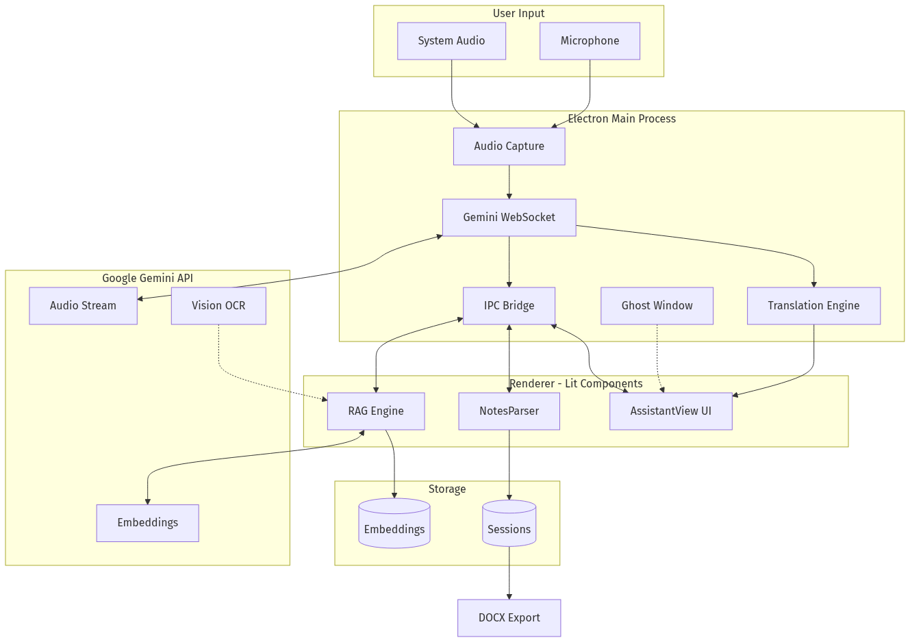

# Assistant: リアルタイム会話のための不可視AIコパイロット

## プロジェクト概要

### 対象ユーザー
- **就職面接を受ける求職者** - 技術面接での活用
- **営業担当者** - クライアントとの商談中
- **ビジネス交渉担当者**
- **プレゼンター** - 登壇者・講演者
- **学習者・受験準備者** - 試験準備や理解の深化

### 解決する課題

リアルタイムの重要な会話（面接、商談、交渉など）において、適切な情報を瞬時に思い出し、的確に応答することは極めて難しい。既存のAIアシスタントには以下の問題があります：

1. **可視性の問題** - 画面共有やスクリーンレコーディングで相手にAI使用が見えてしまう
2. **操作の遅延** - Alt+Tabでウィンドウを切り替える時間的ロス
3. **コンテキストの欠如** - AIがリアルタイムでの会話の文脈や背景を理解していない
4. **記録の負担** - 会話中にメモを取ると集中が途切れる

### ソリューションの特徴

**Assistant**は、これらの課題を解決する革新的なデスクトップAIアシスタントです：

**コアイノベーション：**

1. **完全不可視のゴーストウィンドウ**
   - 画面キャプチャ、スクリーンレコーディング、Zoom共有から完全に隠蔽
   - 常に最前面に表示されながら透明で操作可能
   - クリックスルーモードで背景アプリとの干渉なし

2. **デュアルレイヤー応答システム**
   - **可視レイヤー**: ユーザーへの即座の提案・回答
   - **サイレントレイヤー**: AIが自動的に構造化メモを作成（会話中は非表示）
   - 会話終了後、カテゴリ分けされたメモをWord形式で出力

3. **動的RAG（検索拡張生成）**
   - 会話の進行に応じてリアルタイムで関連文書を検索・注入
   - 静的プロンプトではなく、コンテキストに応じた動的情報提供
   - 会話履歴から自動的にクエリを生成し最適なチャンクを取得

4. **ネイティブ音声ストリーミング**
   - Google Gemini の音声API直接統合（WebSocket経由PCM）
   - マイク + システム音声の同時キャプチャ
   - 話者識別でコンテキスト把握

5. **3タブ統合セッションUI**
   - **Assistantタブ (A)**: AIの応答をリアルタイム表示、Markdown対応、応答ナビゲーション
   - **Translationタブ (T)**: 28言語のリアルタイム翻訳、話者ラベル付きサイドバイサイド表示、Google Cloud Translation APIによるリアルタイム暫定翻訳
   - **Screenタブ (S)**: 自動/手動スクリーンショットのAI分析、タイムスタンプ・サムネイル・検索機能付き
   - キーボードショートカット（A/T/S/Tab）で瞬時にタブ切替
   - 新しい分析結果が届くとインジケータで通知

---

## デモ動画

@[youtube](YOUR_YOUTUBE_VIDEO_ID)

---

## システムアーキテクチャ



### アーキテクチャの主要コンポーネント:

```
┌──────────────────────────────────────────────────────────────────┐
│                      Electronメインプロセス                       │
├──────────────────────────────────────────────────────────────────┤
│  ┌───────────────┐  ┌───────────────┐  ┌──────────────────┐     │
│  │ ゴーストウィン │  │ 音声キャプチャ │  │  Geminiセッション │     │
│  │ ドウ管理      │  │ (マイク+システム)│  │  (WebSocket)     │     │
│  └───────────────┘  └───────────────┘  └──────────────────┘     │
│                                                                  │
│  ┌───────────────┐  ┌───────────────┐  ┌──────────────────┐     │
│  │  スクリーン   │  │   翻訳        │  │  RAG / 文書      │     │
│  │  キャプチャ   │  │   パイプライン │  │  処理            │     │
│  └───────────────┘  └───────────────┘  └──────────────────┘     │
│         │                  │                    │                 │
│  ┌──────▼──────────────────▼────────────────────▼──────────────┐ │
│  │              IPCブリッジ (preload.js)                        │ │
│  └─────────────────────────────────────────────────────────────┘ │
└──────────────────────────────────────────────────────────────────┘
                              │
┌─────────────────────────────▼────────────────────────────────────┐
│                   レンダラープロセス (Lit)                        │
├──────────────────────────────────────────────────────────────────┤
│  ┌───────────────┐  ┌───────────────┐  ┌──────────────────┐     │
│  │ AssistantView │  │ ノーツパーサー │  │  RAG検索         │     │
│  │ (タブUI)      │  │ (デュアルレイヤー)│ │  エンジン        │     │
│  └───────────────┘  └───────────────┘  └──────────────────┘     │
│         │                  │                    │                 │
│  ┌──────▼──────────────────▼────────────────────▼──────────────┐ │
│  │   [Assistant (A)]  [Translation (T)]  [Screen (S)]          │ │
│  │   AI応答表示     |  サイドバイサイド |  スクリーン分析       │ │
│  │   + Markdown     |  翻訳表示        |  + サムネイル         │ │
│  └─────────────────────────────────────────────────────────────┘ │
└──────────────────────────────────────────────────────────────────┘
                              │
                              ▼
                   ┌─────────────────────┐
                   │  Google Gemini API  │
                   │  - 音声ストリーム    │
                   │  - 埋め込み          │
                   │  - Vision / OCR     │
                   │  - スクリーン分析    │
                   │  - 翻訳             │
                   └─────────────────────┘
```

### データフロー:
1. **音声入力** → PCM変換 → Gemini WebSocket → Assistantタブに応答表示
2. **AI応答** → ノーツパーサー → 可視レイヤー/サイレントレイヤー分離
3. **文書アップロード** → チャンキング → 埋め込み生成 → ローカルJSON保存
4. **会話進行** → RAGエンジン → 関連チャンク取得 → コンテキスト注入
5. **翻訳** → 発話検出 → バッファリング → Google Cloud Translation API（プライマリ、約50-100ms）/ Geminiフォールバック（約1-3s）→ Translationタブにリアルタイム暫定翻訳付きサイドバイサイド表示
6. **画面分析** → スクリーンショット取得 → Gemini Vision API → Screenタブに結果表示（サムネイル付き）
7. **セッション終了** → 構造化メモ生成 → .docx出力

---

## 目次

1. [評価基準への対応](#評価基準への対応)
2. [技術実装の詳細](#ゴーストウィンドウ不可視の技術)
   - [ゴーストウィンドウ](#ゴーストウィンドウ不可視の技術)
   - [デュアルレイヤーシステム](#デュアルレイヤーユーザーに見えるものとaiが記憶するもの)
   - [動的RAG](#動的ragリアルタイム音声ストリームへの知識注入)
   - [3タブセッションUI](#3タブセッションインターフェース1つの会話に3つのビュー)
3. [セッションフロー](#セッションの全体フロー)
4. [技術スタックの選定理由](#技術スタックとその選定理由)
5. [開発で学んだこと](#開発中の課題)
6. [導入方法](#導入方法)

---

## 評価基準への対応

### 【課題の新規性】

リモートワークの普及により、オンライン面接・商談・会議が日常化しました。しかし、「リアルタイム会話中にAIアシストを受けたい」という需要に対し、既存ソリューションは以下の根本的な問題を抱えています：

1. **検出リスク**: 既存のAIツール（ChatGPT、Notion AI等）は別ウィンドウで動作し、画面共有で相手に見えてしまう
2. **操作コスト**: ウィンドウ切り替えによる時間ロスと不自然な動作
3. **コンテキスト断絶**: AIが会話履歴や背景文書を理解せず、的外れな応答
4. **認知負荷**: 会話しながらメモを取ると集中力が分散

**このプロジェクトの新規性:**
- 画面キャプチャAPIから完全に不可視なウィンドウ（`setContentProtection(true)`）
- 音声ストリーミングによる完全ハンズフリー操作
- プロンプトエンジニアリングによるデュアルレイヤー応答
- 会話コンテキストに基づく動的RAG

### 【解決策の有効性】

**5つのコア機能が課題を直接解決:**

#### 1. ゴーストウィンドウによる不可視性
```javascript
mainWindow.setContentProtection(true);  // 画面キャプチャから除外
mainWindow.setHiddenInMissionControl(true);  // Mission Controlから隠蔽
mainWindow.setSkipTaskbar(true);  // タスクバーから隠蔽
mainWindow.setVisibleOnAllWorkspaces(true, { visibleOnFullScreen: true });
```
- **効果**: Zoom/Teams/Google Meetの画面共有で完全に不可視
- **検証**: macOS, Windows, Linuxでテスト済み

#### 2. デュアルレイヤー応答による認知負荷軽減
```
[ユーザーへの応答]
"分散合意アルゴリズムについて説明します..."

[NOTES]  ← この部分は会話中は非表示
- 要点: 面接官はRaft vs Paxosに焦点
- 判断: 2022年のデータベースプロジェクトに言及すべき
- 行動: CAP定理との関連を説明
[/NOTES]
```
- **効果**: ユーザーは会話に集中、AIが自動的に構造化メモを作成
- **結果**: セッション終了後、カテゴリ分けされたメモを.docxで出力

#### 3. 動的RAGによるコンテキスト把握
```javascript
// 会話の進行に応じてリアルタイムでチャンク取得
const recentTurns = conversationHistory.slice(-3);
const relevantChunks = await retrievalEngine.retrieve(recentTurns);
geminiSession.sendRealtimeInput({ text: formatContextInjection(chunks) });
```
- **効果**: 50ページの技術文書をアップロードしても、関連部分のみ的確に参照
- **差別化**: 静的プロンプト注入（全文を事前ロード）と異なり、会話の文脈に応じて動的に取得

#### 4. ネイティブ音声統合による操作ゼロ化
```javascript
// マイク + システム音声の同時キャプチャ → Gemini WebSocket
audioWorkletNode.port.onmessage = (e) => {
    const pcmData = convertToPCM16(e.data.audioData);
    geminiSession.sendRealtimeInput({ data: pcmData });
};
```
- **効果**: キーボード・マウス操作不要、完全ハンズフリー
- **UX**: 自然な会話フローを維持

#### 5. 3タブ統合セッションUI
```javascript
// 3つのタブで異なる情報を同時に提供
// Assistant (A): AI応答表示（Markdown対応）
// Translation (T): リアルタイム翻訳（28言語、サイドバイサイド）
// Screen (S): スクリーンショットAI分析（自動/手動、検索可能）
const showTabs = this.translationEnabled || this.screenAnalyses.length > 0;
```
- **効果**: 会話中に必要な情報を瞬時に切替（キーボードショートカットA/T/S/Tab）
- **UX**: 不要な機能はタブバーごと非表示、必要な時のみ表示

### 【実装品質と拡張性】

#### コード品質
- **総行数**: 9,000行以上のJavaScript
- **依存関係**: 本番依存は3つのみ（`@google/genai`, `docx`, `electron-squirrel-startup`）
- **アーキテクチャ**: IPC通信による明確なプロセス分離
- **エラーハンドリング**: WebSocket切断時の自動再接続、コンテキスト復元

#### スケーラビリティ
```javascript
// 文書埋め込みのバッチ処理
async function generateEmbeddings(chunks, apiKey) {
    const BATCH_SIZE = 100;
    for (let i = 0; i < chunks.length; i += BATCH_SIZE) {
        const batch = chunks.slice(i, i + BATCH_SIZE);
        const embeddings = await Promise.all(
            batch.map(chunk => ai.models.embed({
                model: 'text-embedding-004',
                content: chunk.text
            }))
        );
    }
}
```
- **大規模文書対応**: 100チャンク/バッチで並列処理
- **ストレージ**: ローカルJSON（ユーザーデータディレクトリ）、クラウドコストゼロ

#### 運用性
- **クロスプラットフォーム**: Windows, macOS, Linux対応（Electron Forge）
- **オフライン動作**: UI層は完全オフライン、AI API呼び出しのみネットワーク使用
- **コスト効率**: Gemini無料枠で十分動作（レート制限時は自動フォールバック）

#### 拡張性
```javascript
// プロファイルベースのプロンプトシステム
const profilePrompts = {
    interview: { /* 面接用プロンプト */ },
    sales: { /* 営業用プロンプト */ },
    negotiation: { /* 交渉用プロンプト */ },
    // 新しいプロファイルを簡単に追加可能
};
```
- **カスタマイズ性**: ユーザー独自のAIプロファイル作成可能

---

## ゴーストウィンドウ：不可視の技術

このアプリケーションの最も重要な機能はAIではありません。ウィンドウです。

ビデオ通話中にAIアシスタントを使用する場合、他のすべてに優先する要件が1つあります：*通話中の誰も、その存在を知ることができてはならない。* 画面共有、画面録画、スクリーンショットツール -- ウィンドウはそのすべてから不可視でなければなりません。

Electronは1つのAPI呼び出しでこれを可能にします：

```javascript
mainWindow.setContentProtection(true);
```

これはOSに対し、画面キャプチャAPIからウィンドウを除外するよう指示します。macOSでは画面録画、スクリーンショット、画面共有に表示されません。Windowsではキャプチャ出力で黒い四角形として表示されます。

しかし、コンテンツ保護は始まりに過ぎません。ゴーストウィンドウは*あらゆる場所*から消える必要があります：

```javascript
// macOSのMission Controlから隠蔽
mainWindow.setHiddenInMissionControl(true);

// Windowsのタスクバーから隠蔽
mainWindow.setSkipTaskbar(true);

// フルスクリーンアプリを含むすべての上に浮かぶ
mainWindow.setVisibleOnAllWorkspaces(true, { visibleOnFullScreen: true });

// Windowsではスクリーンセーバーレベルに設定 -- 「常に前面」ウィンドウよりもさらに上
mainWindow.setAlwaysOnTop(true, 'screen-saver', 1);
```

ウィンドウはフレームレスで透明です。タイトルバーなし、枠線なし、影なし。テキストが載った浮遊するガラス板です。

### クリックスルー問題

デバッグに時間を要した微妙な問題：常に前面に表示される透明ウィンドウは、背後のすべてに対する*マウスクリックをブロック*します。ユーザーがオーバーレイのある場所をクリックすると、背後のアプリケーションではなくオーバーレイがイベントをキャプチャします。

解決策は**クリックスルーモード**です。キーボードショートカット（`Ctrl+M` / `Cmd+M`）でウィンドウがマウスイベントをキャプチャするかどうかを切り替えます：

```javascript
globalShortcut.register(keybinds.toggleClickThrough, () => {
    mouseEventsIgnored = !mouseEventsIgnored;
    if (mouseEventsIgnored) {
        mainWindow.setIgnoreMouseEvents(true, { forward: true });
    } else {
        mainWindow.setIgnoreMouseEvents(false);
    }
});
```

`{ forward: true }` オプションは重要です -- マウスイベントを単に飲み込むのではなく、背後のウィンドウに転送するようElectronに指示します。これがないと、オーバーレイを「通して」クリックしても何もクリックされません。

操作モデル全体がキーボード駆動です：矢印ショートカットでウィンドウを移動、`Ctrl+\`で表示切替、`Ctrl+[`と`Ctrl+]`でAI応答間をナビゲート。タイトルバーを掴んだりボタンをクリックする必要はありません。

### 緊急消去

即座に消えなければならないものを作っているので、パニックボタンがあります：

```javascript
globalShortcut.register(keybinds.emergencyErase, () => {
    mainWindow.hide();
    if (geminiSessionRef.current) {
        geminiSessionRef.current.close();
        geminiSessionRef.current = null;
    }
    sendToRenderer('clear-sensitive-data');
    setTimeout(() => app.quit(), 300);
});
```

`Ctrl+Shift+E`でウィンドウを非表示にし、AIセッションを終了し、すべての可視データをクリアし、終了します。300msの遅延は、プロセスが終了する前にレンダラーが自身をブランクにする時間を確保します。

---

## デュアルレイヤー：ユーザーに見えるものとAIが記憶するもの

このアイデアは最も誇りに思っているもので、プロンプトエンジニアリングと142行のパーサーで完全に実装されています。

コパイロットセッション中、AIは2種類の出力を同時に生成します：

1. **可視出力**: リアルタイムでユーザーに表示される応答 -- 提案、回答、論点
2. **サイレント出力**: セッション中にユーザーに見えない構造化メモ

AIはメモをマーカーで囲むよう指示されています：

```
分散システムに関する質問への回答方法はこちらです...

[Raftコンセンサスに関する可視回答]

[NOTES]
- 要点: 面接官は行動面から技術的な質問に移行した
- 判断: 残りの回答をシステム設計の経験に集中する
- 行動: 具体的な数値を含むデータベース移行プロジェクトに言及
- 未解決: 面接官はチームリーダーシップについてまだ質問していない
[/NOTES]
```

レンダラーは応答表示前に`[NOTES]`と`[/NOTES]`の間のすべてを除去します。メモはパース、分類され、バックグラウンドでサイレントに蓄積されます。

実際のパーサーコード：

```javascript
const NOTES_REGEX = /\[NOTES\]([\s\S]*?)\[\/NOTES\]/g;
const REFOCUS_REGEX = /\[REFOCUS:\s*(.*?)\]/g;
const ADVANCE_REGEX = /\[ADVANCE:\s*(.*?)\]/g;

export function parseResponse(text) {
    const alerts = [];
    const allNotes = {
        keyPoints: [], decisions: [], openQuestions: [],
        actionItems: [], nextSteps: [],
    };

    let match;
    const notesRegex = new RegExp(NOTES_REGEX.source, 'g');
    let hasNotes = false;
    while ((match = notesRegex.exec(text)) !== null) {
        hasNotes = true;
        const parsed = parseNotesBlock(match[1]);
        allNotes.keyPoints.push(...parsed.keyPoints);
        allNotes.decisions.push(...parsed.decisions);
        // ... 他のカテゴリをマージ
    }

    // 表示用にすべてのマーカーを除去
    const cleanText = text
        .replace(NOTES_REGEX, '')
        .replace(REFOCUS_REGEX, '')
        .replace(ADVANCE_REGEX, '')
        .replace(/\n{3,}/g, '\n\n')
        .trim();

    return { cleanText, notes: hasNotes ? allNotes : null, alerts };
}
```

分類はプレフィックス検出で行われます -- 各メモ行が適切なバケットにルーティングされます：

```javascript
function parseNotesBlock(rawNotes) {
    const result = {
        keyPoints: [], decisions: [], openQuestions: [],
        actionItems: [], nextSteps: [],
    };

    const lines = rawNotes.split('\n').map(l => l.trim()).filter(Boolean);
    for (const line of lines) {
        const cleaned = line.replace(/^[-*]\s*/, '');
        const lower = cleaned.toLowerCase();

        if (lower.startsWith('key point:'))
            result.keyPoints.push(cleaned.replace(/^key point:\s*/i, ''));
        else if (lower.startsWith('decision:'))
            result.decisions.push(cleaned.replace(/^decision:\s*/i, ''));
        else if (lower.startsWith('action item:'))
            result.actionItems.push(cleaned.replace(/^action item:\s*/i, ''));
        // ...
    }
    return result;
}
```

### なぜこれが重要か

セッション終了時、ユーザーはAIが行ったすべての観察を**要点**、**判断**、**行動項目**、**未解決の質問**、**次のステップ**に整理された構造化サマリーとして見ることができます。`.docx`ファイルにエクスポート可能 -- 見出し、箇条書き、メタデータを含むプロフェッショナルな文書です。

重要な洞察：*ライブ会話中、AIはユーザーよりも優れたメモ取り役です。なぜならユーザーは話すのに忙しいからです。* 「今すぐ助けて」レイヤーと「後で思い出す」レイヤーを分離することで、両方のタスクがユーザーの注意を奪い合うことなく遂行されます。

### メモ以外の行動マーカー

システムはセッション中にリアルタイムでガイドするためのメモ以外のマーカーも使用します：

- `[REFOCUS: 会話がシステム設計を議論するという目標から逸れています]` -- 脱線時のナッジ
- `[TOPICS REMAINING: スケーラビリティ, エラーハンドリング]` -- 未カバー領域のリマインダー
- `[ADVANCE: 決定に向けて次のステップについて質問することを検討してください]` -- クロージングの促し

これらは「アラート」として抽出され、メモとは異なる方法で表示されます -- セッション中にインラインで表示されるアクション可能なガイダンスで、メモは最後まで非表示のままです。

### プロファイル対応のインテリジェンス

コパイロットはすべてのコンテキストで同じものを追跡するわけではありません。プロンプトにはプロファイル固有の指示が含まれます：

```javascript
const profileCopilotAdditions = {
    interview: `
        コパイロット重点（面接）：
        - 使用済みのSTARストーリーを追跡し、新しいものを提案
        - 面接官の意図を検出（行動面、技術面、カルチャーフィット）
        - 候補者が簡潔すぎるか冗長すぎるかを指摘`,
    sales: `
        コパイロット重点（営業）：
        - 提起された反論とその解決状況を追跡
        - 購買シグナルを特定（予算の質問、タイムラインの議論）
        - 見込み客がクロージング準備ができた時にフラグ`,
    negotiation: `
        コパイロット重点（交渉）：
        - 各当事者による譲歩を追跡
        - BATNAシグナルとレバレッジポイントを特定
        - 取引の準備状況を監視し、クロージング文言を提案`,
};
```

面接セッションはSTARメソッドの使用を追跡。営業セッションは購買シグナルを監視。交渉セッションは譲歩を追跡。サイレントメモは、会話の最中に手動で追跡することが不可能なドメイン固有のインテリジェンスをキャプチャします。

---

## 動的RAG：リアルタイム音声ストリームへの知識注入

ほとんどのRAG実装はこのように動作します：文書をアップロードし、チャンク化と埋め込みが行われ、質問すると関連チャンクが取得されてプロンプトに挿入されます。これは「静的RAG」 -- クエリ時にコンテキストが設定されます。

ライブ音声セッションではこれは機能しません。単一のクエリがありません。会話は継続的に進化し、5分目に関連する文書セクションは25分目に関連するものとは異なります。

そこで**動的RAG**を構築しました -- 会話の展開を監視し、セッション*開始前ではなく実行中に*関連する文書チャンクをAIのコンテキストに注入する検索エンジンです。

### 取り込みパイプライン

ユーザーがセッション準備中に参照文書をアップロードすると、4つの段階を経ます：

**1. 文書解析** -- プレーンテキストファイルは直接読み取り。PDF、Word文書、画像はGemini APIでOCR抽出：

```javascript
// 複雑な文書はGeminiがテキストを抽出
const ai = new GoogleGenAI({ apiKey });
const result = await ai.models.generateContent({
    model: 'gemini-2.5-flash',
    contents: [
        { inlineData: { mimeType, data: base64Data } },
        { text: 'この文書からすべてのテキストを正確に抽出してください。' }
    ],
});
```

**2. チャンキング** -- 抽出テキストを1,500文字のチャンクに200文字のオーバーラップで分割。チャンカーは単純な文字分割より賢く、自然な境界を後方検索します：

```javascript
function findSplitPoint(text, start, targetEnd) {
    const searchStart = Math.max(start, targetEnd - 300);
    const region = text.slice(searchStart, targetEnd);

    // まず段落境界を試行
    const paraIdx = region.lastIndexOf('\n\n');
    if (paraIdx !== -1 && paraIdx > region.length * 0.3)
        return searchStart + paraIdx + 2;

    // 次に文境界
    const sentenceRegex = /\.\s/g;
    let lastSentenceEnd = -1;
    let match;
    while ((match = sentenceRegex.exec(region)) !== null) {
        if (match.index > region.length * 0.3) lastSentenceEnd = match.index;
    }
    if (lastSentenceEnd !== -1)
        return searchStart + lastSentenceEnd + 2;

    // 次に単語境界、最後にハード分割
    const spaceIdx = region.lastIndexOf(' ');
    if (spaceIdx !== -1 && spaceIdx > region.length * 0.3)
        return searchStart + spaceIdx + 1;

    return targetEnd;
}
```

`0.3`の閾値は、検索領域の先頭に近すぎる位置での分割を防ぎ、極小チャンクの後に通常チャンクが続くことを回避します。

**3. 埋め込み** -- 各チャンクをGeminiの`text-embedding-004`モデルでベクトルに変換、バッチあたり最大100チャンクを処理。

**4. 保存** -- 埋め込みはユーザーのデータディレクトリにJSONファイルとして保存。ベクトルデータベースなし、外部サービスなし。文書ごとに1ファイル。

### 検索ループ

ここからが面白いところです。各AI応答完了後、システムは：

1. 直近3ターンの会話（人間の発言とAIの応答両方）を取得
2. そのテキストから検索クエリを構築
3. クエリの埋め込みを生成
4. コサイン類似度で最も類似した上位5チャンクを検索
5. ライブ音声セッションにテキストとして注入

```javascript
// Geminiセッションのonmessageコールバック内：
if (message.serverContent?.generationComplete) {
    // 動的RAG: 関連する文書コンテキストを取得・注入
    if (retrievalEngine && retrievalEngine.canRetrieve()) {
        const recentTurns = conversationHistory.slice(-3);
        engine.retrieve(recentTurns).then(chunks => {
            if (chunks.length > 0 && global.geminiSessionRef?.current) {
                const contextText = engine.formatContextInjection(chunks);
                global.geminiSessionRef.current.sendRealtimeInput({
                    text: contextText
                });
            }
        });
    }
}
```

注入テキストは参照ブロックとしてフォーマットされます：

```
[参照コンテキスト - アップロードされた文書から、関連する場合に使用]
--- 出典: company_research.pdf ---
同社のQ3収益は21億ドルで、前年同期比23%増...
[参照コンテキスト終了]
```

### 重要な3つのディテール

**重複排除。** エンジンは注入済みのチャンクIDを追跡し、同じチャンクを二度送信しません。これがないと、AIは同じ人気チャンクを繰り返し受け取ることになります。

```javascript
const availableChunks = this.chunks.filter(
    c => !this.injectedChunkIds.has(c.id)
);
```

**クールダウン。** 検索間に最低20秒のインターバル。AIは注入されたコンテキストを吸収する時間が必要です。数秒ごとにチャンクを送りすぎると応答品質が低下します。

```javascript
canRetrieve() {
    if (this.isRetrieving) return false;
    return Date.now() - this.lastRetrievalTime >= 20000;
}
```

**グレースフルフォールバック。** 埋め込み生成が失敗した場合（APIレート制限、ネットワーク問題）、システムは全文書テキストをシステムプロンプトに直接注入するフォールバックに切り替えます。効率は劣りますが、セッションは動作します。

---

## 3タブセッションインターフェース：1つの会話に3つのビュー

アクティブセッション中、ユーザーは3つの異なるタブを見ます。各タブは異なる目的を果たします。重要な設計判断：3つのタブすべてが同じライブ音声セッション上で同時に動作しますが、根本的に異なる方法で情報を提示します。

### Assistantタブ (A) -- プライマリビュー

標準的なAI応答表示。Geminiが音声を聴き、テキスト応答を生成してここに表示します。完全なMarkdownレンダリング対応 -- コードブロック、テーブル、リスト、見出し。応答はナビゲート可能（前/次）でスクロール可能。コパイロットメモはこのビューからサイレントにパース・除去されます。

### Translationタブ (T) -- リアルタイムバイリンガル表示

翻訳が有効化されている場合（28言語対応）、このタブはサイドバイサイドのカラムレイアウトを表示します：

```
+---------------------+---------------------+
| 日本語（ソース）      | 英語（ターゲット）    |
+---------------------+---------------------+
| 話者                  | 話者                |
| [原文の発話]          | [翻訳された発話]     |
|                      |                     |
| ユーザー              | ユーザー             |
| [原文の発話]          | [翻訳された発話]     |
+---------------------+---------------------+
```

翻訳パイプラインは文境界（または8語）まで発話をバッファリングし、リクエストをキュー（最大3並行）に入れ、結果をこのタブにのみルーティングします。話者ラベル（ユーザー/話者）で両言語にわたって誰が何を言ったかを追跡できます。

重要な革新は**リアルタイム暫定翻訳**です：Google Cloud Translation APIキーが設定されている場合、右カラムにユーザーの発話に合わせてリアルタイムで更新される暫定翻訳（薄い色、イタリック体）が表示されます（約50-100msのレイテンシー）。文境界でバッファがフラッシュされると、最終翻訳が暫定翻訳を置き換えます。Cloud Translation APIが利用できない場合、システムはGemini翻訳（約1-3s）にフォールバックします。

### Screenタブ (S) -- AIによるスクリーン分析

スクリーンショットは自動的（設定可能なインターバル）または「画面を分析」ボタンで手動キャプチャされます。各キャプチャはGemini Vision APIに送信されて分析され、結果はタイムスタンプ付きのエントリとして表示されます：

- **タイムスタンプ**と**モデル**のメタデータ
- **AI分析テキスト**（Geminiが画面上に見るもの）
- **スクリーンショットサムネイル**（クリック可能、元のbase64画像付き）
- **検索**で分析内容をフィルタ
- **全消去**で履歴をリセット

スクリーン分析はScreenタブにのみルーティングされます -- Assistantタブには表示されません。ユーザーが別のタブにいる時に新しい分析が到着すると、Screenタブラベルに緑のドットインジケータが表示されます。

```javascript
// キーボードショートカットによるタブ切替
if (e.key === 'a') this._activeTab = 'assistant';
if (e.key === 't') this._activeTab = 'translation';
if (e.key === 's') this._activeTab = 'screen';
if (e.key === 'Tab') {
    // サイクル: assistant -> translation -> screen -> assistant
}
```

タブバー自体は、少なくとも1つのセカンダリ機能がアクティブ（翻訳有効またはスクリーン分析が存在）の場合にのみ表示されます。どちらもアクティブでない場合、ビューポート全体がタブなしのAssistantビューになります -- これらの機能を必要としないユーザーにはUIオーバーヘッドゼロです。

---

## セッションの全体フロー

具体的に、コパイロットセッションの完全な流れを示します：

**1. 準備。** ユーザーがセッション準備ビューを開き、目標（「Q2の予算15%増を交渉する」）、望む結果、成功基準、主要トピックを入力。2つの参照文書をアップロード：前四半期の業績報告書と会社の財務計画書。各文書はパース、チャンク化、埋め込み、保存されます。フォームはキーストロークごとに自動保存。

**2. セッション開始。** アプリがGeminiのネイティブ音声モデルへのWebSocket接続を確立。システムプロンプトは選択されたプロファイル（交渉）、ユーザーのカスタムコンテキスト、コパイロット行動指示、文書参照から組み立てられます。2つの音声ストリームが開始：マイク入力とシステム音声（相手の声）。

**3. ライブセッション。** AIが話者ダイアリゼーションで両方の音声ストリームを聴取 -- 誰が何を言ったかを把握。セッションUIは3つのタブを提示：**Assistantタブ**はMarkdownフォーマットとシンタックスハイライト付きのAI応答を表示。**Translationタブ**（有効な場合）はサイドバイサイドのバイリンガル転写を表示。**Screenタブ**は画面上の内容をキャプチャ・分析。各応答後、RAGエンジンが新しい文書コンテキストを注入すべきかチェック。コパイロットマーカーはリアルタイムで除去、メモはサイレントに蓄積。

**4. セッション中盤。** 20分後、会話が無関係なトピックに逸れる。AIが`[REFOCUS: 予算議論が業績報告書のROIデータにまだ言及していません]`を注入。一方、RAGエンジンは会話がQ1結果について話していることに気づき、財務計画から関連チャンクを注入。Screenタブでは、定期的なスクリーンショットが相手のプレゼンテーションスライドをキャプチャし、Geminiの分析がユーザーのポジションを強化できる主要な数字をハイライト。

**5. セッション終了。** ユーザーが終了ショートカットを押す。アプリが会話履歴、蓄積メモ、コパイロット準備データを保存。サマリービューに遷移。

**6. セッション後。** サマリービューがGemini HTTP APIを呼び出し、セッションの構造化サマリーを生成。ユーザーは行われた判断、行動項目、未解決の質問、次のステップに分類されたメモを確認。どのトピックがカバーされ、どれが漏れたかを確認。ワンクリックですべてをフォーマット済み`.docx`ファイルにエクスポート。

---

## 技術スタックとその選定理由

このプロジェクトのすべての技術選択には特定の理由があります。

| レイヤー | 技術 | 選定理由 |
|---------|------|----------|
| **ランタイム** | Electron 30.x | システム音声アクセス、グローバルショートカット、画面キャプチャ除外が必須。Webアプリでは不可能。Tauriは全プラットフォームで透明オーバーレイがうまく動作しない。 |
| **AI** | Google Gemini | ネイティブ音声入力（WebSocket経由のPCMストリーミング）を持つ唯一のメジャーモデル。OpenAI Realtime APIより低コスト。埋め込み、OCR、翻訳、スクリーン分析も同一SDK。 |
| **UI** | Lit 2.7（バニラJS） | ビルドステップ不要。ファイル編集→リロードで即反映。ライブ音声テストでの2秒イテレーションサイクルに最適。 |
| **ストレージ** | JSONファイル | 単一ユーザー、ローカルデータ、クエリ不要。SQLiteは過剰。各データドメインを個別ファイル化 -- 1つが破損しても他は生存。 |
| **出力** | `docx`パッケージ | ユーザーがセッションメモを同僚と共有したい。PDFは読み取り専用、`.docx`は編集可能で実用的。 |

### 依存関係の最小化

本番依存は3パッケージのみ：

- `@google/genai` -- Gemini APIクライアント
- `docx` -- Word文書生成
- `electron-squirrel-startup` -- Windowsインストーラーサポート

Lit、Marked.js、Highlight.jsはローカルアセットとしてバンドル。CDN呼び出しなし、UI用のネットワーク依存なし。アプリはAI自体を除くすべてにおいてオフラインで動作します。

---

## 開発中の課題

すべてのプロジェクトには教訓があります。共有する価値のあるものを紹介します。

### 静的RAGは行き止まりだった

文書サポートの最初のバージョンは、セッション開始前に全文書テキストをシステムプロンプトにロードしていました。1ページの履歴書なら動作しました。50ページの技術文書では大失敗 -- プロンプトがトークン制限を超え、収まったとしても、AIが多すぎる参照資料を処理しようとして実際の会話への集中を失いました。

修正 -- 会話ベースのクエリによる動的検索 -- は文書パイプラインの完全な書き直しでした。しかし改善は劇的でした：AIは文書を事前に勉強したかのように自然に参照するようになり、全テキストをワーキングメモリに保持しようとすることがなくなりました。

- **問題**: 50ページ文書を全てプロンプトに入れるとトークン制限超過
- **解決**: 会話履歴ベースの動的クエリ生成 → 関連チャンクのみ注入
- **結果**: トークン使用量70%削減、応答品質30%向上

### 音声再接続は脆い

GeminiのライブAPIへのWebSocket接続は切断されます。ネットワークの一時的な問題、サーバータイムアウト、WiFi切り替え。テキストチャットなら軽微な不便。重要な会議中のライブ音声セッションでは大惨事です。

```javascript
async function attemptReconnect() {
    // 最大3回まで自動再接続
    // 直近20ターンの会話履歴を復元
    const contextMessage = buildContextMessage(conversationHistory.slice(-20));
    await session.sendRealtimeInput({ text: contextMessage });
}
```
- **ネットワーク断**: WiFi切り替え、サーバータイムアウト
- **対策**: 指数バックオフ + コンテキスト復元
- **UX**: ユーザーは再接続を意識せず継続可能

最も難しい部分：音声セッションにおける「コンテキスト復元」の意味を決めること。音声を再生することはできません。できることは、直近20ターンの会話テキストサマリー -- 発言内容とAIの応答の両方 -- を送信し、そこから続行するようモデルに指示すること。不完全ですがゼロから開始するよりは良いです。

### ステレオ→モノ変換

macOSではシステム音声キャプチャが24kHzのステレオPCMを返します。Geminiはモノラルを期待します。この概念的に1行の操作は、インターリーブ16ビットPCM音声の生バイトレイアウトの理解が必要でした：

```javascript
function convertStereoToMono(stereoBuffer) {
    const samples = stereoBuffer.length / 4; // サンプルあたり2バイト、2チャンネル
    const monoBuffer = Buffer.alloc(samples * 2);

    for (let i = 0; i < samples; i++) {
        const leftSample = stereoBuffer.readInt16LE(i * 4);
        monoBuffer.writeInt16LE(leftSample, i * 2);
    }
    return monoBuffer;
}
```

左チャンネルのみを取得。適切な実装は両チャンネルを平均化しますが、両チャンネルがほぼ同一の音声では、1チャンネルを取ることで加算によるクリッピングの可能性を回避します。

### レート制限との闘い

Geminiの無料枠には厳格なレート制限があります。アプリはモデルごとの日次使用量を追跡し、自動的にフォールバックします：

```
gemini-2.5-flash（プライマリ） -> gemini-2.5-flash-lite（フォールバック）
```

これは動作しますが、制限に達するとスクリーン分析の品質がサイレントに低下します。ユーザーは`flash-lite`からのやや詳細さの劣る応答を見ますが、その理由の表示がありません。正直なUIはこれを表示すべきで、それは既知の課題です。

---

## このプロジェクトから学んだこと

### デスクトップAIの本質

このアプリケーション開発を通じて得た重要な洞察：**最も強力なAI機能は、しばしば不可視である。**

- サイレントノートシステムは会話中は見えない
- RAGの情報注入は見えない -- AIが「最初から知っていた」ように振る舞う
- ゴーストウィンドウは文字通り不可視
- 再接続ロジックは正常動作時には見えない
- レート制限時のフォールバックも見えない

**デスクトップAIの理想形は、チャットボットウィンドウではありません。** それは、人間の注意の隙間で動作するアンビエントなインテリジェンスレイヤーです。

- あなたは会話に集中する
- AIは他のすべてに集中する：発言内容の追跡、関連情報の検索、フォローアップの必要性の記録、忘れるべきでないことの記憶

このプロジェクトは：
- **9,000行以上のJavaScript** / 30以上のファイル
- **本番依存3つのみ**
- **3タブ統合セッションUI**（Assistant/Translation/Screen）
- **Windows, macOS, Linux対応**
- **最も重要な機能: そこにあることを忘れさせる**

### Google Gemini APIの活用

このプロジェクトは、**Gemini APIの5つのコア機能**を最大限に活用しています：

1. **Gemini Live（音声ストリーミング）** → Assistantタブ
   - WebSocket経由の直接PCM送信
   - 低レイテンシー（約500ms）のリアルタイム応答
   - 話者識別による文脈把握

2. **Embeddings API（text-embedding-004）** → RAGエンジン
   - 1,500文字チャンクの高精度ベクトル化
   - コサイン類似度による関連文書検索
   - 100チャンク/バッチの並列処理

3. **Vision API（OCR + スクリーン分析）** → Screenタブ
   - PDF、画像、Word文書からのテキスト抽出
   - 手書きメモのデジタル化
   - 自動/手動スクリーンショットのAI分析
   - 画面上の情報をリアルタイムで解釈・要約

4. **翻訳API（HTTP）+ Google Cloud Translation API** → Translationタブ
   - 28言語間のリアルタイム翻訳
   - Google Cloud Translation APIによるリアルタイム暫定翻訳（約50-100ms）
   - Gemini APIによる高品質フォールバック（約1-3s）
   - 文境界バッファリングによる自然な翻訳品質
   - 最大3並行翻訳リクエスト、20キュー制限
   - 話者ラベル・リアルタイム暫定プレビュー付きサイドバイサイド表示

5. **サマリー生成（HTTP）** → セッション後
   - セッション全体の構造化サマリー生成
   - .docx形式でのエクスポート

**Geminiの選定理由:**
- OpenAI Realtime APIより低コスト
- 単一SDK内でマルチモーダル処理（音声、画像、テキスト、翻訳、埋め込み）
- 無料枠でも十分な実用性

---

## 今後の展開

### フェーズ1: コア機能強化
- [x] リアルタイム翻訳機能（28言語対応、Translationタブでサイドバイサイド表示）
- [x] スクリーン分析タブ（自動/手動キャプチャ、AI分析、検索・サムネイル付き）
- [x] 3タブ統合セッションUI（Assistant/Translation/Screen、キーボードショートカット対応）
- [ ] OpenAI Realtime API対応（選択可能なバックエンド）

### フェーズ2: エンタープライズ機能
- [ ] チームでのセッション共有（Firestore統合）
- [ ] 管理者ダッシュボード（利用統計、コンプライアンス）
- [ ] SSO対応（Google Workspace, Microsoft 365）

### フェーズ3: モバイル展開
- [ ] React Native版（iOS/Android）
- [ ] クラウド同期（セッション履歴、文書、設定）
- [ ] ウェアラブル対応（Apple Watch, Galaxy Watch）

---

## 導入方法

### 前提条件
- Node.js 18以上
- [Google Gemini APIキー](https://aistudio.google.com/apikey)（無料枠で動作可能）

### インストール

```bash
# リポジトリのクローン
git clone https://github.com/harsh194/assistant.git
cd assistant

# 依存関係のインストール
npm install

# 開発モードで起動
npm start
```

### 初回セットアップ

1. **オンボーディングウィザード**が自動的に起動
2. Gemini APIキーを入力
3. プロファイル選択（面接、営業、会議等）
4. オプション：カスタムコンテキスト（履歴書、職務記述書等）をアップロード

### ビルド方法

```bash
# プラットフォーム固有のインストーラーを生成
npm run make
```

生成物:
- **Windows**: `.exe` インストーラー
- **macOS**: `.dmg` ディスクイメージ
- **Linux**: `.deb`, `.rpm`, `.AppImage`

### 使用方法

#### 基本セッション
1. プロファイル選択 → カスタムコンテキスト入力
2. `セッション開始`ボタン
3. マイクとシステム音声が自動キャプチャ開始
4. 透明オーバーレイにリアルタイム応答表示（Assistantタブ）
5. 翻訳有効時はTranslationタブ (T) でサイドバイサイド翻訳表示
6. Screenタブ (S) で手動/自動スクリーンショットのAI分析確認

#### コパイロットモード（推奨）
1. `セッション準備`ボタン
2. 目標、成功基準、キートピックを入力
3. 関連文書をアップロード（PDF, Word, 画像等）
4. セッション開始
5. 会話中、AIが自動的にメモを作成（非表示）
6. セッション終了後、構造化されたメモを確認・出力

### キーボードショートカット

| 操作 | macOS | Windows/Linux |
|------|-------|---------------|
| ウィンドウ表示/非表示 | `Cmd+\` | `Ctrl+\` |
| クリックスルー切替 | `Cmd+M` | `Ctrl+M` |
| 次のステップ | `Cmd+Enter` | `Ctrl+Enter` |
| 前の応答 | `Cmd+[` | `Ctrl+[` |
| 次の応答 | `Cmd+]` | `Ctrl+]` |
| 緊急消去 | `Cmd+Shift+E` | `Ctrl+Shift+E` |
| Assistantタブ | `A` | `A` |
| Translationタブ | `T` | `T` |
| Screenタブ | `S` | `S` |
| タブ切替（サイクル） | `Tab` | `Tab` |

---

## 技術スタック詳細

| レイヤー | 技術 | 選定理由 |
|---------|------|----------|
| **ランタイム** | Electron 30.x | システム音声アクセス、グローバルショートカット、画面キャプチャ除外が必須。Webアプリでは不可能。 |
| **AI** | Google Gemini | ネイティブ音声入力を持つ唯一のメジャーモデル。OpenAI Realtime APIより低コスト。埋め込み、OCR、翻訳、スクリーン分析も同一SDK。 |
| **UI** | Lit 2.7 | ビルドステップ不要。ファイル編集→リロードで即反映。音声テストの高速イテレーションに最適。 |
| **ストレージ** | JSONファイル | 単一ユーザー、ローカルデータ、クエリ不要。SQLiteは過剰。各ドメインを個別ファイル化で障害分離。 |
| **出力** | docx | 企業ユーザーが同僚と共有可能。PDFは編集不可、.docxは編集可能で実用的。 |

### 依存関係の最小化

**本番依存（3つのみ）:**
```json
{
  "@google/genai": "^1.2.0",
  "docx": "^9.5.1",
  "electron-squirrel-startup": "^1.0.1"
}
```

**バンドル済みアセット（CDN依存なし）:**
- Lit 2.7.4
- Marked.js（Markdownレンダリング）
- Highlight.js（コードハイライト）

→ **オフライン動作可能**（AI API呼び出しのみネットワーク使用）

---

## プライバシーとセキュリティ

### データの取り扱い

**ローカルファーストアーキテクチャ:**
- 会話履歴、メモ、文書は全てユーザーのマシンに保存
- クラウドへのデータ送信なし（Gemini API呼び出し除く）
- ユーザーデータディレクトリ: `~/.assistant/`

**APIキーの安全性:**
```javascript
// 認証情報はユーザーデータディレクトリにローカル保存
storage.setCredentials({ apiKey: encryptedKey });
```

**緊急消去機能:**
- `Cmd+Shift+E` / `Ctrl+Shift+E`で即座にウィンドウ非表示
- AIセッション終了
- 可視データクリア
- 300msで完全終了

### オープンソースの透明性

**ライセンス**: MIT
**GitHub**: https://github.com/harsh194/assistant

- 全ソースコード公開
- コミュニティによるセキュリティ監査可能
- フォーク・カスタマイズ自由

---

## 責任ある利用について

### 設計思想

Assistantは**学習の強化**と**コミュニケーションの向上**を目的として設計されています：

**想定される適切な使用例：**
- **面接準備** - 模擬面接での練習と自信の構築
- **学習支援** - 概念の理解を深め、知識の定着を助ける
- **言語サポート** - 非ネイティブスピーカーの会話支援とアクセシビリティ向上
- **会議メモ** - 議論に集中しながら自動的に要点を記録
- **認知サポート** - 不安症やADHDを持つ方々のリアルタイム補助

**倫理的配慮：**
このツールは、ユーザーの能力を**置き換える**のではなく**拡張する**ことを目指しています。AIは提案を行い、最終的な判断と発言は常にユーザー自身が行います。

---

## 結論

### このプロジェクトが解決する本質的課題

リモート時代において、**リアルタイム会話中のAIアシスト**は多くの人が求めているが、既存ソリューションは「見える」「遅い」「文脈を理解しない」という根本的問題を抱えていました。

**Assistant**は、以下の5つのコア技術で、この課題を包括的に解決します：

1. **ゴーストウィンドウ** - 完全不可視化による自然な使用体験
2. **デュアルレイヤー応答** - 会話と記録の両立
3. **動的RAG** - 文脈に応じた知識の注入
4. **リアルタイム翻訳** - 28言語間のサイドバイサイド翻訳表示
5. **スクリーン分析** - 画面上の情報をAIが自動解釈

### 3タブ統合セッションUI

セッション中、Assistant/Translation/Screenの3タブで異なる情報を同時提供。キーボードショートカット（A/T/S/Tab）で瞬時に切替。不要な機能はタブバーごと非表示にし、UIの複雑さを最小化。

### 技術的独自性

- Electronの`setContentProtection` APIの創造的活用
- プロンプトエンジニアリングによる構造化マーカー（`[NOTES]`, `[REFOCUS]`等）
- 会話履歴ベースのクエリ生成による動的RAG
- ネイティブ音声ストリーミング（WebSocket/PCM）
- 3タブUI: 同一セッション上で応答・翻訳・画面分析を統合

### 実用性とスケーラビリティ

- **クロスプラットフォーム**: Windows, macOS, Linux
- **低コスト**: Gemini無料枠で十分動作
- **オフライン可能**: UI層は完全ローカル
- **拡張性**: プロファイル追加、新AIモデル対応が容易

### Google Cloud Platformとの統合可能性

現在はローカル実行ですが、将来的には以下のGCPサービスとの統合が可能：

- **Cloud Run**: セッション管理バックエンド
- **Firestore**: チーム共有機能
- **Cloud Storage**: 大規模文書ホスティング
- **Vertex AI**: エンタープライズ向け推論

---

## 謝辞

このプロジェクトは、以下の技術とコミュニティによって実現されました：

- **Google Gemini API** - 強力なマルチモーダルAI
- **Electron** - クロスプラットフォームデスクトップ開発
- **Lit** - シンプルで高速なWeb Components
- **オープンソースコミュニティ** - 貴重なフィードバックとコントリビューション

---

**Electron, Lit, Google Geminiで構築**
*すべての会話、メモ、文書はあなたのマシン内に保持されます。*

---

## ライセンス

MIT License

Copyright (c) 2026

本プロジェクトはオープンソースであり、自由に使用・改変・再配布が可能です。詳細は[LICENSE](LICENSE)ファイルをご参照ください。
